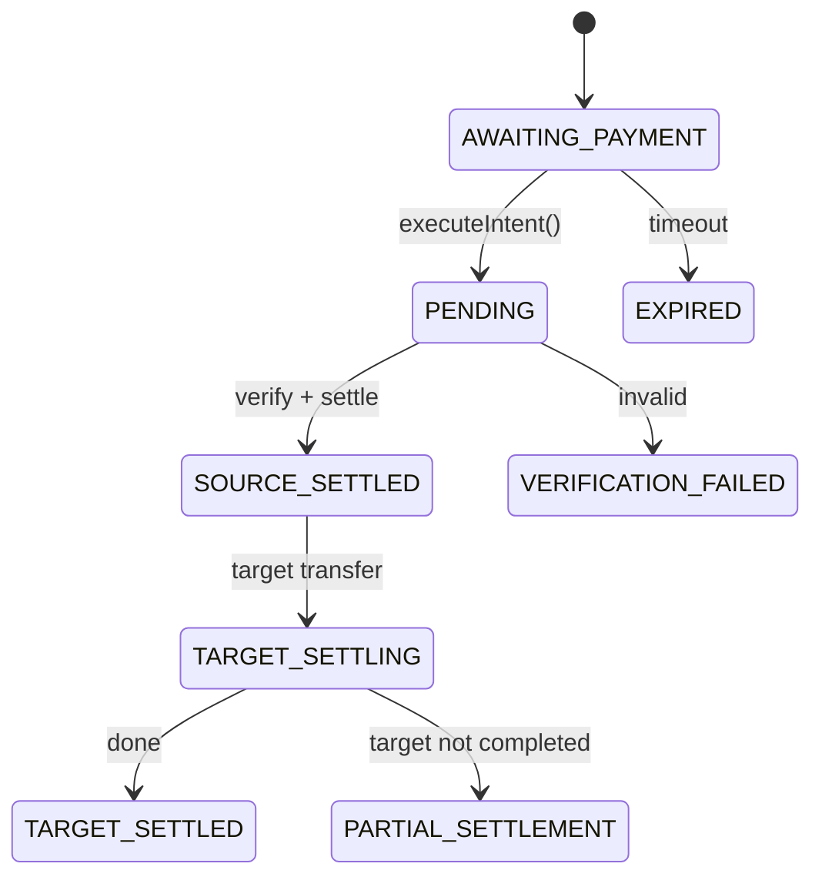

# Agent Authenticated Payment — Backend-Signed Payment Workflow

This skill enables AI agents (like OpenClaw) to complete the **entire AgentTech setup and payment workflow automatically**: authenticate with email, create API keys programmatically, initialize authenticated SDK client, create payment intents, and execute payments. No manual dashboard interaction required.

**Use Case:** Choose this mode when you want **backend-automated signing** - the backend handles all transaction signing automatically. You don't need to manage private keys or sign transactions locally. Perfect for agents that want simplicity and don't need direct control over signing.

**SDK Support:** This skill uses the AgentTech SDK (JavaScript/TypeScript and Go) with **authenticated mode** (`PayClient`) for automated backend-signed payments. Requires API key and secret key.

---

## JSON Schema Definition

```json
{
  "name": "agent_authenticated_payment",
  "description": "Complete end-to-end automation for AI agents: authenticate with email, create API key programmatically, and execute automated payments using AgentTech SDK with authenticated mode. Backend automatically signs payments - no private key management required.",
  "input_schema": {
    "type": "object",
    "properties": {
      "email": {
        "type": "string",
        "description": "Email address for authentication and account setup"
      },
      "agent_name": {
        "type": "string",
        "description": "Name for the agent to be created (optional, defaults to auto-generated name)"
      },
      "recipient": {
        "type": "string",
        "description": "Recipient wallet address (Base 0x address) or email address"
      },
      "amount": {
        "type": "string",
        "description": "USDC amount as string (e.g. '10.50'). Minimum: 0.01, Maximum: 1,000,000. Up to 6 decimal places."
      },
      "payer_chain": {
        "type": "string",
        "description": "Source chain identifier. See Supported Chains documentation for the full list of supported chains."
      }
    },
    "required": ["email", "recipient", "amount", "payer_chain"]
  },
  "output_schema": {
    "type": "object",
    "properties": {
      "api_key": {
        "type": "string",
        "description": "Created API key for authenticated requests"
      },
      "agent_id": {
        "type": "string",
        "description": "Created agent identifier"
      },
      "intent_id": {
        "type": "string",
        "description": "Unique identifier for the created intent"
      },
      "status": {
        "type": "string",
        "enum": ["TARGET_SETTLED", "EXPIRED", "VERIFICATION_FAILED", "PARTIAL_SETTLEMENT"],
        "description": "Final status of the payment"
      },
      "transaction_hash": {
        "type": "string",
        "description": "Transaction hash on the target chain (available when status is TARGET_SETTLED)"
      }
    },
    "required": ["api_key", "intent_id", "status"]
  }
}
```

---

## Quick Start (5 Steps)

1. **Authenticate with email** — Login or register account via email (API or automation script).
2. **Create agent and API key** — Programmatically create agent and generate API key/secret key.
3. **Initialize authenticated SDK client** — Use `PayClient` with API key and secret key.
4. **Create payment intent** — Use SDK `createIntent()` with `recipient`, `amount`, `payer_chain`.
5. **Execute payment** — Use SDK `executeIntent(intentId)` to complete payment (backend signs automatically).

### Complete Example (TypeScript)

```typescript
import { PayClient } from '@cross402/usdc';

async function completeAutomatedPayment(
  email: string,
  recipient: string,
  amount: string,
  payerChain: string,
  targetChain?: string,
) {
  // Step 1: Authenticate and create API key
  const { apiKey, secretKey, agentId } = await setupAgentAccount(email);

  // Step 2: Initialize authenticated SDK client
  const client = new PayClient({
    baseUrl: 'https://api-pay.agent.tech',
    auth: { apiKey, secretKey },
  });

  // Step 3: Create intent (targetChain optional; defaults to "base")
  const intent = await client.createIntent({
    recipient,
    amount,
    payerChain,
    targetChain,
  });

  console.log(`Intent created: ${intent.intentId}`);

  // Step 4: Execute payment (backend signs automatically)
  const result = await client.executeIntent(intent.intentId);
  console.log(`Payment executed. Status: ${result.status}`);

  // Step 5: Poll until completion
  let finalIntent = result;
  while (
    finalIntent.status !== 'TARGET_SETTLED' &&
    finalIntent.status !== 'EXPIRED' &&
    finalIntent.status !== 'PARTIAL_SETTLEMENT' &&
    finalIntent.status !== 'VERIFICATION_FAILED'
  ) {
    await new Promise(resolve => setTimeout(resolve, 3000));
    finalIntent = await client.getIntent(intent.intentId);
    console.log(`Status: ${finalIntent.status}`);
  }

  if (finalIntent.status === 'TARGET_SETTLED') {
    console.log(`Payment complete! Transaction: ${finalIntent.targetPayment.txHash}`);
    return {
      success: true,
      api_key: apiKey,
      agent_id: agentId,
      intent_id: finalIntent.intentId,
      transaction_hash: finalIntent.targetPayment.txHash,
    };
  } else {
    throw new Error(`Payment failed: ${finalIntent.status}`);
  }
}
```

---

## Getting API Key — Overview

To use AgentTech with authenticated mode, you need to obtain an API key and secret key. There are two ways to do this:

1. **Manual Method**: Visit the [AgentTech Dashboard](https://agent.tech/dashboard) and manually create an agent to get your API credentials.
2. **Automated Method**: Use browser automation (Puppeteer/Selenium) to programmatically login, create an agent, and extract API credentials.

**Dashboard URL**: [https://agent.tech/dashboard](https://agent.tech/dashboard)

**Manual Steps** (for reference):
1. Visit [https://agent.tech/dashboard](https://agent.tech/dashboard)
2. Sign in with your email address
3. Click "Create Agent" to create a new agent
4. After creating the agent, click "Generate API Key" to get your API key and secret key
5. Save both the API key and secret key securely

**Note**: Each account can create up to 10 agents maximum. Each agent has its own unique API key and secret key.

---

## Step 1: Authenticate with Email

Authenticate with email to obtain session token or access credentials. Two approaches:

### Option A: API-Based Authentication (if available)

If the AgentTech API provides authentication endpoints:

```typescript
async function authenticateWithEmail(email: string): Promise<string> {
  // POST /api/auth/login or /api/auth/register
  const response = await fetch('https://api-pay.agent.tech/api/auth/login', {
    method: 'POST',
    headers: { 'Content-Type': 'application/json' },
    body: JSON.stringify({ email }),
  });
  
  if (!response.ok) {
    throw new Error(`Authentication failed: ${response.statusText}`);
  }
  
  const data = await response.json();
  return data.session_token || data.access_token;
}
```

### Option B: Browser Automation (Puppeteer/Playwright)

If API endpoints are not available, use browser automation to login via dashboard:

**TypeScript with Puppeteer:**

```bash
npm install puppeteer
```

```typescript
import puppeteer from 'puppeteer';

async function authenticateWithEmailAutomated(email: string): Promise<string> {
  const browser = await puppeteer.launch({ headless: true });
  const page = await browser.newPage();
  
  try {
    // Navigate to dashboard
    await page.goto('https://agent.tech/dashboard');
    
    // Wait for login form and enter email
    await page.waitForSelector('input[type="email"]', { timeout: 10000 });
    await page.type('input[type="email"]', email);
    
    // Click login/submit button
    await page.click('button[type="submit"]');
    
    // Wait for email verification or OTP (adjust based on actual flow)
    // For email magic link, you may need to check email inbox
    // For OTP, you may need to provide OTP code
    
    // Wait for dashboard to load
    await page.waitForSelector('[data-testid="dashboard"]', { timeout: 30000 });
    
    // Extract session token from cookies or localStorage
    const cookies = await page.cookies();
    const sessionCookie = cookies.find(c => c.name.includes('session') || c.name.includes('token'));
    
    await browser.close();
    
    if (!sessionCookie) {
      throw new Error('Failed to obtain session token');
    }
    
    return sessionCookie.value;
  } catch (error) {
    await browser.close();
    throw error;
  }
}
```

**Python with Selenium:**

```python
from selenium import webdriver
from selenium.webdriver.common.by import By
from selenium.webdriver.support.ui import WebDriverWait
from selenium.webdriver.support import expected_conditions as EC

async def authenticate_with_email_automated(email: str) -> str:
    driver = webdriver.Chrome()
    try:
        driver.get('https://agent.tech/dashboard')
        
        # Wait for email input and enter email
        email_input = WebDriverWait(driver, 10).until(
            EC.presence_of_element_located((By.CSS_SELECTOR, 'input[type="email"]'))
        )
        email_input.send_keys(email)
        
        # Submit form
        submit_button = driver.find_element(By.CSS_SELECTOR, 'button[type="submit"]')
        submit_button.click()
        
        # Wait for dashboard (adjust based on actual flow)
        WebDriverWait(driver, 30).until(
            EC.presence_of_element_located((By.CSS_SELECTOR, '[data-testid="dashboard"]'))
        )
        
        # Extract session token
        session_cookie = driver.get_cookie('session') or driver.get_cookie('token')
        
        if not session_cookie:
            raise Exception('Failed to obtain session token')
        
        return session_cookie['value']
    finally:
        driver.quit()
```

---

## Step 2: Create Agent and API Key

After authentication, create an agent and generate API key/secret key programmatically.

### Option A: API-Based Agent Creation (if available)

```typescript
async function createAgentAndAPIKey(
  sessionToken: string,
  agentName?: string
): Promise<{ apiKey: string; secretKey: string; agentId: string }> {
  // POST /api/agents or /v2/agents
  const response = await fetch('https://api-pay.agent.tech/v2/agents', {
    method: 'POST',
    headers: {
      'Content-Type': 'application/json',
      'Authorization': `Bearer ${sessionToken}`,
    },
    body: JSON.stringify({
      name: agentName || `agent-${Date.now()}`,
    }),
  });
  
  if (!response.ok) {
    throw new Error(`Agent creation failed: ${response.statusText}`);
  }
  
  const agent = await response.json();
  
  // Generate API key for the agent
  const keyResponse = await fetch(`https://api-pay.agent.tech/v2/agents/${agent.id}/keys`, {
    method: 'POST',
    headers: {
      'Authorization': `Bearer ${sessionToken}`,
    },
  });
  
  if (!keyResponse.ok) {
    throw new Error(`API key generation failed: ${keyResponse.statusText}`);
  }
  
  const keyData = await keyResponse.json();
  
  return {
    apiKey: keyData.api_key,
    secretKey: keyData.secret_key,
    agentId: agent.id,
  };
}
```

### Option B: Browser Automation

Use browser automation to navigate to the dashboard, create an agent, and extract API credentials. This is the recommended approach for full automation.

**Dashboard URL**: [https://agent.tech/dashboard](https://agent.tech/dashboard)

**TypeScript with Puppeteer:**

```typescript
import puppeteer from 'puppeteer';

async function createAgentAndAPIKeyAutomated(
  sessionToken: string,
  agentName?: string
): Promise<{ apiKey: string; secretKey: string; agentId: string }> {
  const browser = await puppeteer.launch({ 
    headless: false, // Set to true for production, false for debugging
    args: ['--no-sandbox', '--disable-setuid-sandbox']
  });
  const page = await browser.newPage();
  
  try {
    // Set session cookie from authentication
    await page.setCookie({
      name: 'session',
      value: sessionToken,
      domain: 'agent.tech',
      path: '/',
    });
    
    // Navigate to dashboard
    await page.goto('https://agent.tech/dashboard', { waitUntil: 'networkidle2' });
    
    // Wait for dashboard to load and look for "Create Agent" button
    // Try multiple possible selectors
    const createAgentSelectors = [
      'button:has-text("Create Agent")',
      'a:has-text("Create Agent")',
      '[data-testid="create-agent"]',
      'button[aria-label*="Create Agent"]',
      '.create-agent-button',
    ];
    
    let createAgentButton = null;
    for (const selector of createAgentSelectors) {
      try {
        await page.waitForSelector(selector, { timeout: 5000 });
        createAgentButton = await page.$(selector);
        if (createAgentButton) break;
      } catch (e) {
        continue;
      }
    }
    
    if (!createAgentButton) {
      throw new Error('Could not find "Create Agent" button on dashboard');
    }
    
    await createAgentButton.click();
    await page.waitForTimeout(1000); // Wait for modal/form to appear
    
    // Enter agent name if provided
    if (agentName) {
      const nameSelectors = [
        'input[name="agentName"]',
        'input[name="name"]',
        'input[placeholder*="agent" i]',
        'input[type="text"]',
      ];
      
      for (const selector of nameSelectors) {
        try {
          const nameInput = await page.$(selector);
          if (nameInput) {
            await nameInput.type(agentName, { delay: 50 });
            break;
          }
        } catch (e) {
          continue;
        }
      }
    }
    
    // Submit agent creation form
    const submitSelectors = [
      'button[type="submit"]',
      'button:has-text("Create")',
      'button:has-text("Submit")',
      '[data-testid="submit"]',
    ];
    
    for (const selector of submitSelectors) {
      try {
        const submitButton = await page.$(selector);
        if (submitButton) {
          await submitButton.click();
          break;
        }
      } catch (e) {
        continue;
      }
    }
    
    // Wait for agent to be created and navigate to agent details page
    await page.waitForTimeout(2000);
    
    // Look for "Generate API Key" button or API key section
    const apiKeySelectors = [
      'button:has-text("Generate API Key")',
      'button:has-text("Generate Key")',
      '[data-testid="generate-api-key"]',
      'button[aria-label*="API Key" i]',
    ];
    
    let generateButton = null;
    for (const selector of apiKeySelectors) {
      try {
        await page.waitForSelector(selector, { timeout: 5000 });
        generateButton = await page.$(selector);
        if (generateButton) break;
      } catch (e) {
        continue;
      }
    }
    
    if (generateButton) {
      await generateButton.click();
      await page.waitForTimeout(2000); // Wait for API keys to be generated
    }
    
    // Extract API key and secret key from the page
    // Try multiple possible selectors and extraction methods
    let apiKey = '';
    let secretKey = '';
    let agentId = '';
    
    // Method 1: Look for specific data attributes or test IDs
    try {
      apiKey = await page.$eval('[data-testid="api-key-value"]', el => el.textContent?.trim() || '');
      secretKey = await page.$eval('[data-testid="secret-key-value"]', el => el.textContent?.trim() || '');
    } catch (e) {
      // Method 2: Look for input fields with readonly or copy buttons
      try {
        const apiKeyInputs = await page.$$eval('input[readonly], input[type="text"]', inputs => {
          return inputs.map(input => input.value).filter(v => v && v.length > 20);
        });
        if (apiKeyInputs.length >= 2) {
          apiKey = apiKeyInputs[0];
          secretKey = apiKeyInputs[1];
        }
      } catch (e2) {
        // Method 3: Look for text content containing API key patterns
        const pageContent = await page.content();
        const apiKeyMatch = pageContent.match(/api[_-]?key["\s:>]+([a-zA-Z0-9_-]{20,})/i);
        const secretKeyMatch = pageContent.match(/secret[_-]?key["\s:>]+([a-zA-Z0-9_-]{20,})/i);
        if (apiKeyMatch) apiKey = apiKeyMatch[1];
        if (secretKeyMatch) secretKey = secretKeyMatch[1];
      }
    }
    
    // Extract agent ID if available
    try {
      const url = page.url();
      const agentIdMatch = url.match(/\/agents\/([a-zA-Z0-9_-]+)/);
      if (agentIdMatch) {
        agentId = agentIdMatch[1];
      }
    } catch (e) {
      // Agent ID extraction failed, continue without it
    }
    
    await browser.close();
    
    if (!apiKey || !secretKey) {
      throw new Error('Failed to extract API credentials. Please check the dashboard manually at https://agent.tech/dashboard');
    }
    
    console.log('✅ Successfully extracted API credentials');
    console.log(`API Key: ${apiKey.substring(0, 8)}...`);
    console.log(`Secret Key: ${secretKey.substring(0, 8)}...`);
    
    return {
      apiKey: apiKey.trim(),
      secretKey: secretKey.trim(),
      agentId: agentId.trim() || `agent-${Date.now()}`,
    };
  } catch (error) {
    console.error('Error during agent creation:', error);
    // Take a screenshot for debugging
    await page.screenshot({ path: 'error-screenshot.png' });
    await browser.close();
    throw new Error(`Failed to create agent and extract API key: ${error.message}. Dashboard: https://agent.tech/dashboard`);
  }
}
```

**Python with Selenium:**

```python
from selenium import webdriver
from selenium.webdriver.common.by import By
from selenium.webdriver.support.ui import WebDriverWait
from selenium.webdriver.support import expected_conditions as EC
from selenium.common.exceptions import TimeoutException
import time
import re

async def create_agent_and_api_key_automated(session_token: str, agent_name: str = None) -> dict:
    """Create agent and extract API key using Selenium."""
    driver = webdriver.Chrome()
    try:
        # Set session cookie
        driver.get('https://agent.tech/dashboard')
        driver.add_cookie({'name': 'session', 'value': session_token, 'domain': 'agent.tech'})
        
        # Navigate to dashboard
        driver.get('https://agent.tech/dashboard')
        time.sleep(2)
        
        # Find and click "Create Agent" button
        create_agent_selectors = [
            "//button[contains(text(), 'Create Agent')]",
            "//a[contains(text(), 'Create Agent')]",
            "//button[@data-testid='create-agent']",
        ]
        
        create_button = None
        for selector in create_agent_selectors:
            try:
                create_button = WebDriverWait(driver, 5).until(
                    EC.presence_of_element_located((By.XPATH, selector))
                )
                if create_button:
                    create_button.click()
                    break
            except TimeoutException:
                continue
        
        if not create_button:
            raise Exception("Could not find 'Create Agent' button")
        
        time.sleep(1)
        
        # Enter agent name if provided
        if agent_name:
            name_inputs = driver.find_elements(By.CSS_SELECTOR, 'input[name="agentName"], input[name="name"]')
            if name_inputs:
                name_inputs[0].send_keys(agent_name)
        
        # Submit form
        submit_buttons = driver.find_elements(By.CSS_SELECTOR, 'button[type="submit"], button:contains("Create")')
        if submit_buttons:
            submit_buttons[0].click()
        
        time.sleep(2)
        
        # Find and click "Generate API Key" button
        generate_selectors = [
            "//button[contains(text(), 'Generate API Key')]",
            "//button[contains(text(), 'Generate Key')]",
        ]
        
        for selector in generate_selectors:
            try:
                generate_button = WebDriverWait(driver, 5).until(
                    EC.presence_of_element_located((By.XPATH, selector))
                )
                if generate_button:
                    generate_button.click()
                    time.sleep(2)
                    break
            except TimeoutException:
                continue
        
        # Extract API key and secret key
        api_key = ''
        secret_key = ''
        
        # Try to find input fields with API credentials
        inputs = driver.find_elements(By.CSS_SELECTOR, 'input[readonly], input[type="text"]')
        values = [inp.get_attribute('value') for inp in inputs if inp.get_attribute('value') and len(inp.get_attribute('value')) > 20]
        
        if len(values) >= 2:
            api_key = values[0]
            secret_key = values[1]
        else:
            # Fallback: extract from page source
            page_source = driver.page_source
            api_key_match = re.search(r'api[_-]?key["\s:>]+([a-zA-Z0-9_-]{20,})', page_source, re.IGNORECASE)
            secret_key_match = re.search(r'secret[_-]?key["\s:>]+([a-zA-Z0-9_-]{20,})', page_source, re.IGNORECASE)
            if api_key_match:
                api_key = api_key_match.group(1)
            if secret_key_match:
                secret_key = secret_key_match.group(1)
        
        # Extract agent ID from URL
        agent_id = ''
        url = driver.current_url
        agent_id_match = re.search(r'/agents/([a-zA-Z0-9_-]+)', url)
        if agent_id_match:
            agent_id = agent_id_match.group(1)
        
        if not api_key or not secret_key:
            raise Exception('Failed to extract API credentials. Please check dashboard manually: https://agent.tech/dashboard')
        
        return {
            'apiKey': api_key.strip(),
            'secretKey': secret_key.strip(),
            'agentId': agent_id.strip() or f'agent-{int(time.time())}',
        }
    except Exception as e:
        driver.save_screenshot('error-screenshot.png')
        raise Exception(f'Failed to create agent: {str(e)}. Dashboard: https://agent.tech/dashboard')
    finally:
        driver.quit()
```

### Combined Setup Function

This function combines authentication and agent creation, with fallback to browser automation:

```typescript
async function setupAgentAccount(
  email: string,
  agentName?: string
): Promise<{ apiKey: string; secretKey: string; agentId: string }> {
  console.log('🔐 Starting authentication and agent setup...');
  console.log(`📧 Email: ${email}`);
  console.log(`🌐 Dashboard: https://agent.tech/dashboard`);
  
  // Step 1: Authenticate
  let sessionToken: string;
  try {
    console.log('Attempting API-based authentication...');
    sessionToken = await authenticateWithEmail(email);
    console.log('✅ API authentication successful');
  } catch (error) {
    console.log('⚠️ API authentication failed, using browser automation...');
    sessionToken = await authenticateWithEmailAutomated(email);
    console.log('✅ Browser authentication successful');
  }
  
  // Step 2: Create agent and get API key
  try {
    console.log('Attempting API-based agent creation...');
    const result = await createAgentAndAPIKey(sessionToken, agentName);
    console.log('✅ API-based agent creation successful');
    return result;
  } catch (error) {
    console.log('⚠️ API agent creation failed, using browser automation...');
    console.log('🌐 Opening browser to create agent at https://agent.tech/dashboard');
    const result = await createAgentAndAPIKeyAutomated(sessionToken, agentName);
    console.log('✅ Browser-based agent creation successful');
    return result;
  }
}
```

**Important Notes:**
- If browser automation fails, you can manually visit [https://agent.tech/dashboard](https://agent.tech/dashboard) to create an agent and get API credentials
- The extracted API key and secret key should be saved securely for future use
- Each account can create up to 10 agents

---

## Step 3: Initialize Authenticated SDK Client

After obtaining API key and secret key, initialize the authenticated SDK client.

> **Verify the credentials first.** Call `client.getMe()` (JS/TS) or `client.GetMe(ctx)` (Go) — both back onto `GET /v2/me` — before creating intents. The handler is cheap (no DB hit), confirms the key is wired up correctly, and returns the agent's funded EVM/Solana wallet addresses so you can pre-flight balances. Treat any 401 from `/v2/me` as a hard configuration error rather than retrying.

### TypeScript/JavaScript

```typescript
import { PayClient } from '@cross402/usdc';

const client = new PayClient({
  baseUrl: 'https://api-pay.agent.tech',
  auth: { apiKey: 'your-api-key', secretKey: 'your-secret-key' },
});
```

### Go

```go
import "github.com/cross402/usdc-sdk-go"

client, err := pay.NewClient(
    "https://api-pay.agent.tech",
    pay.WithBearerAuth(apiKey, secretKey),
)
if err != nil {
    log.Fatal(err)
}
```

---

## Step 4: Create Payment Intent

Create a payment intent using the authenticated client:

### TypeScript/JavaScript

```typescript
const intent = await client.createIntent({
  recipient: '0x742d35Cc6634C0532925a3b844Bc9e7595f0bEb',
  amount: '10.50',
  payerChain: 'base',
});

console.log(`Intent created: ${intent.intentId}`);
console.log(`Status: ${intent.status}`);
```

### Go

```go
ctx := context.Background()

resp, err := client.CreateIntent(ctx, &pay.CreateIntentRequest{
    Recipient:  "0x742d35Cc6634C0532925a3b844Bc9e7595f0bEb",
    Amount:     "10.50",
    PayerChain: "base",
})
if err != nil {
    log.Fatal(err)
}

log.Printf("Intent created: %s", resp.IntentID)
log.Printf("Status: %s", resp.Status)
```

---

## Step 5: Execute Payment

With authenticated mode, use `executeIntent()` to complete payment. The backend automatically signs and transfers USDC on Base:

### TypeScript/JavaScript

```typescript
const result = await client.executeIntent(intent.intentId);

console.log(`Payment executed. Status: ${result.status}`);

if (result.status === 'TARGET_SETTLED') {
  console.log(`Transaction hash: ${result.targetPayment.txHash}`);
}
```

### Go

```go
exec, err := client.ExecuteIntent(ctx, resp.IntentID)
if err != nil {
    log.Fatal(err)
}

log.Printf("Payment executed. Status: %s", exec.Status)

if exec.Status == pay.StatusTargetSettled {
    log.Printf("Transaction hash: %s", exec.TargetPayment.TxHash)
}
```

---

## Complete Payment Flow with Polling

Full example with status polling:

### TypeScript/JavaScript Complete Example

```typescript
import { PayClient } from '@cross402/usdc';

async function completeAutomatedPaymentFlow(
  email: string,
  recipient: string,
  amount: string,
  payerChain: 'base' | 'solana',
  agentName?: string
) {
  // Step 1: Setup agent account and get API credentials
  const { apiKey, secretKey, agentId } = await setupAgentAccount(email, agentName);
  console.log(`Agent created: ${agentId}`);
  console.log(`API Key: ${apiKey.substring(0, 8)}...`);

  // Step 2: Initialize authenticated SDK client
  const client = new PayClient({
    baseUrl: 'https://api-pay.agent.tech',
    auth: { apiKey, secretKey },
  });

  // Step 3: Create intent
  const intent = await client.createIntent({
    recipient,
    amount,
    payerChain,
  });

  console.log(`Intent created: ${intent.intentId}`);
  console.log(`Status: ${intent.status}`);
  console.log(`Expires at: ${intent.expiresAt}`);

  // Step 4: Execute payment
  const executeResult = await client.executeIntent(intent.intentId);
  console.log(`Payment executed. Status: ${executeResult.status}`);

  // Step 5: Poll until completion
  let currentIntent = executeResult;
  const maxAttempts = 60; // 10 minutes max (60 * 10 seconds)
  let attempts = 0;

  while (
    currentIntent.status !== 'TARGET_SETTLED' &&
    currentIntent.status !== 'EXPIRED' &&
    currentIntent.status !== 'PARTIAL_SETTLEMENT' &&
    currentIntent.status !== 'VERIFICATION_FAILED' &&
    attempts < maxAttempts
  ) {
    await new Promise(resolve => setTimeout(resolve, 10000)); // Poll every 10 seconds
    attempts++;

    try {
      currentIntent = await client.getIntent(intent.intentId);
      console.log(`[${attempts}] Status: ${currentIntent.status}`);
    } catch (error) {
      console.error(`Error polling status: ${error}`);
      // Continue polling on transient errors
    }
  }

  // Final status check
  if (currentIntent.status === 'TARGET_SETTLED') {
    console.log('✅ Payment complete!');
    console.log(`Transaction hash: ${currentIntent.targetPayment?.txHash}`);
    return {
      success: true,
      api_key: apiKey,
      agent_id: agentId,
      intent_id: currentIntent.intentId,
      status: currentIntent.status,
      transaction_hash: currentIntent.targetPayment?.txHash,
    };
  } else {
    console.error(`❌ Payment failed: ${currentIntent.status}`);
    return {
      success: false,
      api_key: apiKey,
      agent_id: agentId,
      intent_id: currentIntent.intentId,
      status: currentIntent.status,
    };
  }
}

// Usage
completeAutomatedPaymentFlow(
  'agent@example.com',
  '0x742d35Cc6634C0532925a3b844Bc9e7595f0bEb',
  '10.50',
  'base',
  'my-automated-agent'
).then(result => {
  console.log('Final result:', result);
});
```

### Go Complete Example

```go
package main

import (
    "context"
    "fmt"
    "log"
    "time"
    "github.com/cross402/usdc-sdk-go"
)

func completeAutomatedPaymentFlow(
    ctx context.Context,
    email string,
    recipient string,
    amount string,
    payerChain string,
    agentName string,
) error {
    // Step 1: Setup agent account and get API credentials
    credentials, err := setupAgentAccount(email, agentName)
    if err != nil {
        return err
    }
    
    log.Printf("Agent created: %s", credentials.AgentID)
    log.Printf("API Key: %s...", credentials.APIKey[:8])

    // Step 2: Initialize authenticated SDK client
    client, err := pay.NewClient(
        "https://api-pay.agent.tech",
        pay.WithBearerAuth(credentials.APIKey, credentials.SecretKey),
    )
    if err != nil {
        return err
    }

    // Step 3: Create intent
    resp, err := client.CreateIntent(ctx, &pay.CreateIntentRequest{
        Recipient:  recipient,
        Amount:     amount,
        PayerChain: payerChain,
    })
    if err != nil {
        return err
    }

    log.Printf("Intent created: %s", resp.IntentID)
    log.Printf("Status: %s", resp.Status)

    // Step 4: Execute payment
    execResult, err := client.ExecuteIntent(ctx, resp.IntentID)
    if err != nil {
        return err
    }

    log.Printf("Payment executed. Status: %s", execResult.Status)

    // Step 5: Poll until completion
    maxAttempts := 60
    attempts := 0
    currentIntent := execResult

    for attempts < maxAttempts {
        if currentIntent.Status == pay.StatusTargetSettled ||
           currentIntent.Status == pay.StatusExpired ||
           currentIntent.Status == pay.StatusPartialSettlement ||
           currentIntent.Status == pay.StatusVerificationFailed {
            break
        }

        time.Sleep(10 * time.Second)
        attempts++

        intent, err := client.GetIntent(ctx, resp.IntentID)
        if err != nil {
            log.Printf("Error polling status: %v", err)
            continue
        }

        currentIntent = intent
        log.Printf("[%d] Status: %s", attempts, currentIntent.Status)
    }

    // Final status check
    if currentIntent.Status == pay.StatusTargetSettled {
        log.Println("✅ Payment complete!")
        log.Printf("Transaction hash: %s", currentIntent.TargetPayment.TxHash)
        return nil
    } else {
        return fmt.Errorf("payment failed: %s", currentIntent.Status)
    }
}
```

---

## Payment Flow and Status

With authenticated mode, the payment flow is simplified:

1. **Create Intent** → `AWAITING_PAYMENT`
2. **Execute Intent** → Backend automatically signs and processes payment
3. **Status Progression**: `PENDING` → `SOURCE_SETTLED` → `TARGET_SETTLING` → `TARGET_SETTLED`

**Status values:**

| Status | Description |
|--------|-------------|
| `AWAITING_PAYMENT` | Intent created; ready for execution |
| `PENDING` | Execution initiated; processing |
| `SOURCE_SETTLED` | Payment confirmed on the source chain |
| `TARGET_SETTLING` | Settlement is being processed on the target chain |
| `TARGET_SETTLED` | Done; merchant received USDC on the target chain (terminal state) |
| `PARTIAL_SETTLEMENT` | Partial amount settled; remainder not fulfilled (terminal state) |
| `VERIFICATION_FAILED` | Payment verification failed (terminal state) |
| `EXPIRED` | Intent timed out (e.g. 10 min) (terminal state) |



---

## Error Handling

### Common Errors

| HTTP Status | Error Type | Description | Solution |
|-------------|------------|-------------|----------|
| 400 | ValidationError | Invalid input, invalid payer_chain, invalid email/recipient/amount | Fix request parameters |
| 401 | RequestError | Unauthorized - invalid or missing API credentials | Verify API key and secret key |
| 402 | RequestError | Insufficient agent balance on payer chain | Top up the agent wallet for that chain |
| 404 | RequestError | Intent not found, **or** intent owned by another agent. The v2 endpoints collapse both rejections to the same `404 payment intent not found` body so callers cannot probe foreign intent IDs by observing a 403/404 split | Verify intent ID *and* that it was created under the same API key |
| 429 | RequestError | Rate limited | Implement exponential backoff, retry after delay |
| 503 | RequestError | Service unavailable | Retry after delay |

### Error Handling Example

```typescript
import { PayClient, PayApiError } from '@cross402/usdc';

async function handlePaymentWithRetry(
  client: PayClient,
  intentId: string
) {
  let retries = 0;
  const maxRetries = 3;

  while (retries < maxRetries) {
    try {
      return await client.executeIntent(intentId);
    } catch (error) {
      if (error instanceof PayApiError) {
        // Don't retry on client errors
        if (error.statusCode === 400 || error.statusCode === 404) {
          throw error;
        }
        // Retry on server errors
        if (error.statusCode === 503 || error.statusCode === 500) {
          retries++;
          if (retries >= maxRetries) {
            throw error;
          }
          await new Promise(resolve => setTimeout(resolve, 1000 * retries));
          continue;
        }
      }
      throw error;
    }
  }
}
```

---

## Security and Best Practices

- **API Key Storage**: Store API keys and secret keys securely (environment variables, secret management services). Never commit to version control.
- **Session Management**: If using browser automation, handle session tokens securely and implement proper cleanup.
- **Rate Limiting**: Implement exponential backoff for API calls to avoid rate limits.
- **Error Recovery**: Implement retry logic for transient errors (503, 500, network issues).
- **Agent Limits**: Each account can create up to 10 agents maximum. Reuse existing agents when possible.
- **HTTPS Only**: Ensure all API calls are made over encrypted connections.

---

## Summary Checklist

- [ ] Authenticate with email (API or browser automation)
- [ ] Create agent and generate API key/secret key programmatically
- [ ] Initialize authenticated SDK client: `new PayClient()` with API credentials
- [ ] Create intent: `client.createIntent()` (recipient, amount, payer_chain)
- [ ] Execute payment: `client.executeIntent(intentId)` (backend signs automatically)
- [ ] Poll `client.getIntent(intentId)` until `TARGET_SETTLED` or terminal status
- [ ] Handle errors with retry logic for transient failures
- [ ] Store API credentials securely for future use

---

## Related Links

- [Create Intent](create-intent.md)
- [Execute Intent](execute-intent.md)
- [Query Intent Status](query-intent-status.md)
- [Payment Polling](payment-polling.md)
- [Error Handling](error-handling.md)
- [Agent Public Payment](agent-public-payment.md) (Public mode workflow)
- [API Documentation: Authentication](../api/auth.md)
- [API Documentation: Intents](../api/intents.md)
