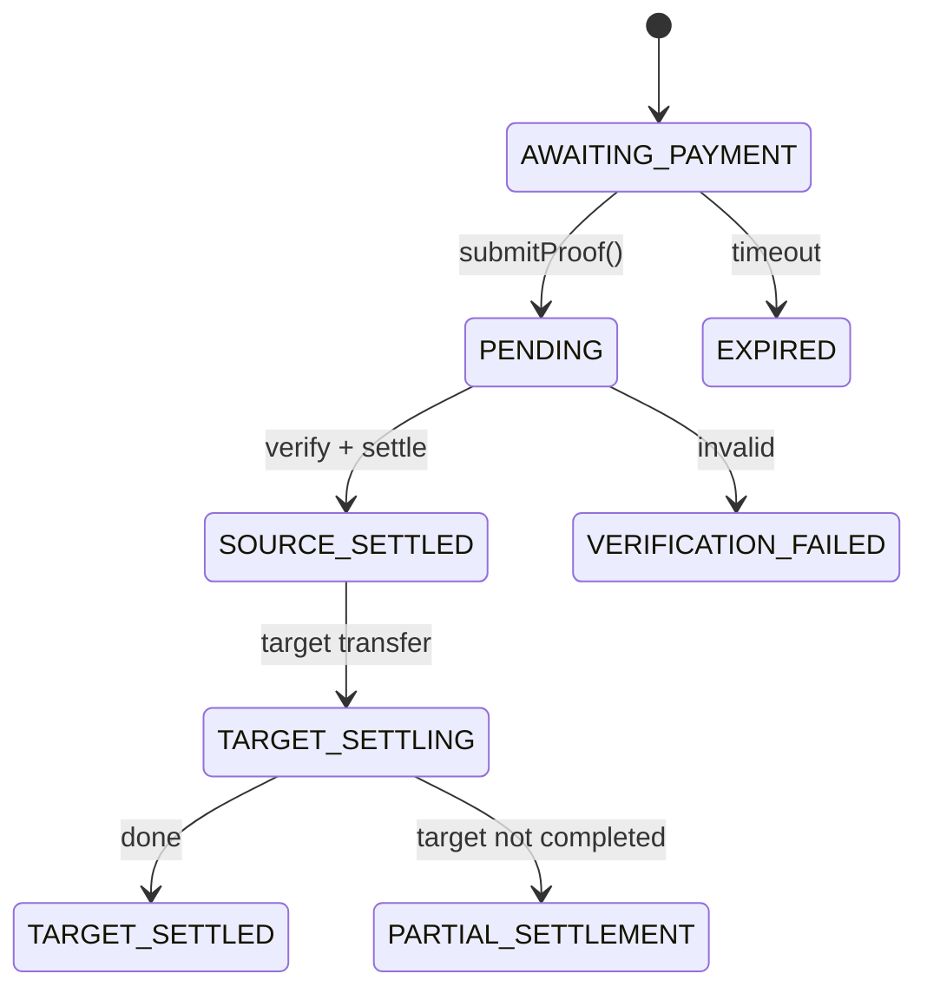

# Agent Public Payment — Local-Signed Payment Workflow

This skill enables AI agents to complete cross-chain USDC payments **end-to-end without a browser or human**: generate wallets locally, create a payment intent via the SDK, sign the x402 payload with your local key, submit the proof, and poll until settled. The payer chain and the target (merchant) chain can differ — both legs settle through the x402 protocol; the SDK derives the correct signing flavor for each chain from `payment_requirements`.

**Use Case:** Choose this mode when you need **full control over private keys** and want to sign transactions locally. No API key required - perfect for agents that need direct control over signing and wallet management. Private keys never leave your machine.

**SDK Support:** This skill uses the AgentTech SDK (JavaScript/TypeScript and Go) in **public mode** (`PublicPayClient`). No API key required - you sign X402 proofs locally.

---

## JSON Schema Definition

```json
{
  "name": "agent_public_payment",
  "description": "Complete end-to-end X402 cross-chain payment automation for AI agents using AgentTech SDK in public mode. Generates wallets locally, creates intents, signs X402 proofs locally, submits proofs, and polls for completion. No API key required, full control over private keys.",
  "input_schema": {
    "type": "object",
    "properties": {
      "recipient": {
        "type": "string",
        "description": "Recipient wallet address (Base 0x address) or email address"
      },
      "email": {
        "type": "string",
        "description": "Recipient email address (alternative to recipient)"
      },
      "amount": {
        "type": "string",
        "description": "USDC amount as string (e.g. '10.50'). Minimum: 0.01, Maximum: 1,000,000. Up to 6 decimal places."
      },
      "payer_chain": {
        "type": "string",
        "description": "Source chain identifier. See Supported Chains documentation for the full list of supported chains."
      },
      "wallet_type": {
        "type": "string",
        "enum": ["evm", "solana"],
        "description": "Type of wallet to use for signing (must match payer_chain)"
      }
    },
    "required": ["amount", "payer_chain", "wallet_type"],
    "oneOf": [
      { "required": ["email"] },
      { "required": ["recipient"] }
    ]
  },
  "output_schema": {
    "type": "object",
    "properties": {
      "intent_id": {
        "type": "string",
        "description": "Unique identifier for the created intent"
      },
      "status": {
        "type": "string",
        "enum": ["TARGET_SETTLED", "EXPIRED", "VERIFICATION_FAILED", "PARTIAL_SETTLEMENT"],
        "description": "Final status of the payment"
      },
      "transaction_hash": {
        "type": "string",
        "description": "Transaction hash on the target chain (available when status is TARGET_SETTLED)"
      },
      "payer_wallet": {
        "type": "object",
        "description": "Generated wallet information"
      }
    },
    "required": ["intent_id", "status"]
  }
}
```

---

## Quick Start (4 Steps)

1. **Generate and save wallets** (EVM for Base, Solana) — see [Step 1: Generate Wallets](#step-1-generate-wallets).
2. **Create payment intent** — Use SDK `createIntent()` with `email` or `recipient`, `amount`, `payer_chain` → get `intent_id` and `payment_requirements`.
3. **Sign X402 locally** using `payment_requirements` and your wallet private key → produce `settle_proof` (base64 string). See [Step 2: Sign and Produce settle_proof](#step-2-sign-and-produce-settle_proof).
4. **Submit proof** — Use SDK `submitProof(intentId, settleProof)`, then **poll** `getIntent(intentId)` until `status` is `TARGET_SETTLED` (success) or a terminal failure (`EXPIRED`, `VERIFICATION_FAILED`, `PARTIAL_SETTLEMENT`).

### Complete Example (TypeScript)

```typescript
import { PublicPayClient } from '@cross402/usdc';
import { Wallet } from 'ethers';
import { buildEVMsettleProof } from './x402-signing';

async function completeX402Payment(recipient: string, amount: string) {
  // Step 1: Generate or load wallet
  const wallet = Wallet.createRandom();
  const payerAddress = wallet.address;
  const privateKey = wallet.privateKey;

  // Step 2: Initialize SDK client
  const client = new PublicPayClient({
    baseUrl: 'https://api-pay.agent.tech',
  });

  // Step 3: Create intent — payer on Base, merchant paid on Ethereum.
  const intent = await client.createIntent({
    recipient,
    amount,
    payerChain: 'base',
    targetChain: 'ethereum',
  });

  console.log(`Intent created: ${intent.intentId}`);
  console.log(`Payment requirements:`, intent.paymentRequirements);

  // Step 4: Sign X402 proof locally
  const settleProof = buildEVMsettleProof(
    intent.paymentRequirements,
    payerAddress,
    privateKey
  );

  // Step 5: Submit proof
  const result = await client.submitProof(intent.intentId, settleProof);
  console.log(`Proof submitted. Status: ${result.status}`);

  // Step 6: Poll until completion
  let finalIntent = result;
  while (
    finalIntent.status !== 'TARGET_SETTLED' &&
    finalIntent.status !== 'PARTIAL_SETTLEMENT' &&
    finalIntent.status !== 'EXPIRED' &&
    finalIntent.status !== 'VERIFICATION_FAILED'
  ) {
    await new Promise(resolve => setTimeout(resolve, 3000));
    finalIntent = await client.getIntent(intent.intentId);
    console.log(`Status: ${finalIntent.status}`);
  }

  if (finalIntent.status === 'TARGET_SETTLED') {
    console.log(`Payment complete! Transaction: ${finalIntent.targetPayment.txHash}`);
    return {
      success: true,
      intentId: finalIntent.intentId,
      txHash: finalIntent.targetPayment.txHash,
    };
  } else {
    throw new Error(`Payment failed: ${finalIntent.status}`);
  }
}
```

---

## Step 1: Generate Wallets

Generate payer wallets **locally**. Private keys never leave your machine; the SDK only ever receives a signed `settle_proof`.

### EVM wallet (any EVM payer chain)

**TypeScript/JavaScript (ethers):**

```bash
npm install ethers
```

```typescript
import { Wallet } from 'ethers';

const wallet = Wallet.createRandom();
const evmWallet = {
  type: 'evm',
  symbol: 'ETH',
  address: wallet.address,
  private_key: wallet.privateKey,
  mnemonic: wallet.mnemonic?.phrase,
};

console.log(`EVM Address: ${wallet.address}`);
console.log(`Private Key: ${wallet.privateKey}`);
```

**Go:**

```go
package main

import (
    "crypto/ecdsa"
    "fmt"
    "github.com/ethereum/go-ethereum/accounts"
    "github.com/ethereum/go-ethereum/crypto"
)

func generateEVMWallet() (string, string, error) {
    privateKey, err := crypto.GenerateKey()
    if err != nil {
        return "", "", err
    }
    
    publicKey := privateKey.Public()
    publicKeyECDSA, ok := publicKey.(*ecdsa.PublicKey)
    if !ok {
        return "", "", fmt.Errorf("error casting public key")
    }
    
    address := crypto.PubkeyToAddress(*publicKeyECDSA).Hex()
    privateKeyHex := fmt.Sprintf("%x", crypto.FromECDSA(privateKey))
    
    return address, privateKeyHex, nil
}
```

### Solana

**TypeScript/JavaScript (@solana/web3.js):**

```bash
npm install @solana/web3.js
```

```typescript
import { Keypair } from '@solana/web3.js';
import * as bs58 from 'bs58';

const keypair = Keypair.generate();
const solWallet = {
  type: 'solana',
  symbol: 'SOL',
  address: keypair.publicKey.toBase58(),
  private_key: bs58.encode(keypair.secretKey),
};

console.log(`Solana Address: ${keypair.publicKey.toBase58()}`);
```

**Go:**

```go
package main

import (
    "encoding/base64"
    "fmt"
    "github.com/gagliardetto/solana-go"
)

func generateSolanaWallet() (string, string, error) {
    keypair := solana.NewWallet()
    address := keypair.PublicKey().String()
    privateKey := base64.StdEncoding.EncodeToString(keypair.PrivateKey)
    
    return address, privateKey, nil
}
```

### Save Wallets Locally

Store credentials at `~/.config/x402pay/wallets.json` (or equivalent).

**TypeScript:**

```typescript
import * as fs from 'fs';
import * as path from 'path';
import * as os from 'os';

function saveWallets(evmWallet: any, solWallet: any) {
  const walletsData = {
    created_at: new Date().toISOString(),
    wallets: [evmWallet, solWallet],
  };
  
  const configDir = path.join(os.homedir(), '.config', 'x402pay');
  fs.mkdirSync(configDir, { recursive: true });
  
  const filePath = path.join(configDir, 'wallets.json');
  fs.writeFileSync(filePath, JSON.stringify(walletsData, null, 2));
  
  console.log(`Wallets saved to ${filePath}`);
}
```

**Go:**

```go
package main

import (
    "encoding/json"
    "os"
    "path/filepath"
    "time"
)

type WalletData struct {
    CreatedAt string   `json:"created_at"`
    Wallets   []Wallet `json:"wallets"`
}

func saveWallets(evmWallet, solWallet Wallet) error {
    walletsData := WalletData{
        CreatedAt: time.Now().UTC().Format(time.RFC3339),
        Wallets:   []Wallet{evmWallet, solWallet},
    }
    
    configDir := filepath.Join(os.Getenv("HOME"), ".config", "x402pay")
    os.MkdirAll(configDir, 0755)
    
    filePath := filepath.Join(configDir, "wallets.json")
    data, err := json.MarshalIndent(walletsData, "", "  ")
    if err != nil {
        return err
    }
    
    return os.WriteFile(filePath, data, 0600)
}
```

**Security:** Private keys are generated and stored only on your machine. The SDK never receives your private key; it only receives the base64-encoded signed payload (`settle_proof`).

---

## Step 2: Sign and Produce settle_proof

The SDK expects `settle_proof` to be **exactly**: **Base64(JSON.stringify(x402_v2_payload))**. The backend decodes base64, parses JSON, verifies the payload (including `accepted.amount` vs intent), and forwards it to the X402 facilitator for settlement. If the format is wrong, verification fails (400).

**Always use the `payment_requirements` returned by `createIntent()`** when building the payload — do not hardcode chain IDs or contract addresses.

### Choosing the Signing Method

The signing method is a property of the **payer chain**, not of the target chain. AgentPay communicates the method via `payment_requirements` returned by `createIntent()`. Always inspect the returned object rather than hardcoding per chain:

| `payment_requirements` signal | Signing Method | Typical payer chains |
|---|---|---|
| `network` starts with `solana:` | Solana VersionedTransaction v0 (partial sign) | Solana (Live) |
| `extra.assetTransferMethod === "permit2"` | Permit2 `PermitWitnessTransferFrom` + EIP-2612 `Permit` | BSC, Monad, MegaETH (all 🚧 coming soon) |
| otherwise (EVM network, no `assetTransferMethod`) | EIP-3009 `TransferWithAuthorization` | Base, Ethereum, Polygon, HyperEVM (Live); Arbitrum, SKALE Base (🚧 coming soon) |

```typescript
function chooseSigningMethod(paymentRequirements: PaymentRequirements): string {
  const network = paymentRequirements.network;

  // Solana chains
  if (network.startsWith('solana:')) {
    return 'solana';
  }

  // EVM chains — the Permit2 + EIP-2612 path is opt-in per chain
  if (paymentRequirements.extra?.assetTransferMethod === 'permit2') {
    return 'permit2';
  }

  return 'eip3009';
}
```

The signing method is independent from the `target_chain` you picked. Whether the merchant receives on Base, Ethereum, Polygon, or Solana, the payer-side signing path is whatever `payment_requirements` tells you.

### 2a. EIP-3009 path — `TransferWithAuthorization`

**TypeScript Example (ethers):**

```typescript
import { Wallet } from 'ethers';
import * as crypto from 'crypto';

interface PaymentRequirements {
  scheme: string;
  network: string;
  amount: string;
  asset: string;
  payTo: string;
  maxTimeoutSeconds: number;
  resource?: string;
  description?: string;
  extra?: {
    name?: string;
    version?: string;
    assetTransferMethod?: 'permit2';  // present on chains that require Permit2 + EIP-2612
    feePayer?: string;                // Solana: fee payer public key
    decimals?: number;                // Solana: token decimals
  };
}

function buildEVMsettleProof(
  paymentRequirements: PaymentRequirements,
  payerAddress: string,
  privateKey: string
): string {
  // Parse chainId from CAIP-2 (eip155:8453 -> 8453)
  const network = paymentRequirements.network;
  const chainIdMatch = network.match(/eip155:(\d+)/);
  if (!chainIdMatch) {
    throw new Error(`Invalid network format: ${network}`);
  }
  const chainId = parseInt(chainIdMatch[1], 10);

  const amount = paymentRequirements.amount;
  const payTo = paymentRequirements.payTo;
  const asset = paymentRequirements.asset;
  const extra = paymentRequirements.extra || {};
  const name = extra.name || 'USD Coin';
  const version = extra.version || '2';
  const maxTimeout = paymentRequirements.maxTimeoutSeconds || 600;

  // Generate nonce
  const nonce = '0x' + crypto.randomBytes(32).toString('hex');
  
  // Set validity window
  const now = Math.floor(Date.now() / 1000);
  const validAfter = (now - 600).toString();
  const validBefore = (now + maxTimeout).toString();

  // Build EIP-712 domain
  const domain = {
    name,
    version,
    chainId,
    verifyingContract: asset,
  };

  // Build EIP-712 types
  const types = {
    TransferWithAuthorization: [
      { name: 'from', type: 'address' },
      { name: 'to', type: 'address' },
      { name: 'value', type: 'uint256' },
      { name: 'validAfter', type: 'uint256' },
      { name: 'validBefore', type: 'uint256' },
      { name: 'nonce', type: 'bytes32' },
    ],
  };

  // Build message
  const message = {
    from: payerAddress,
    to: payTo,
    value: amount,
    validAfter,
    validBefore,
    nonce,
  };

  // Sign with ethers
  const wallet = new Wallet(privateKey);
  const signature = wallet.signTypedData(domain, types, message);

  // Build X402 v2 payload
  const payload = {
    x402Version: 2,
    resource: {
      url: paymentRequirements.resource || '/api/intents',
      description: paymentRequirements.description || 'X402 payment',
      mimeType: 'application/json',
    },
    accepted: {
      scheme: paymentRequirements.scheme || 'exact',
      network,
      amount,
      asset,
      payTo,
      maxTimeoutSeconds: maxTimeout,
      extra: paymentRequirements.extra || {},
    },
    payload: {
      signature: signature,
      authorization: {
        from: payerAddress,
        to: payTo,
        value: amount,
        validAfter,
        validBefore,
        nonce,
      },
    },
  };

  // Encode as base64
  return Buffer.from(JSON.stringify(payload)).toString('base64');
}
```

### 2b. Permit2 path — `PermitWitnessTransferFrom` + EIP-2612 Gas Sponsoring

When `payment_requirements.extra.assetTransferMethod === "permit2"` the payer chain requires the Permit2 flow (designated for BSC, Monad, MegaETH — all 🚧 [coming soon](../api/chains.md); the exact set is whatever the backend flags). This flow requires **two signatures**:

1. **Permit2 PermitWitnessTransferFrom** — authorizes the X402 proxy to transfer USDC via Permit2
2. **EIP-2612 Permit** — approves the canonical Permit2 contract to spend your USDC (gas sponsoring: the backend submits the tx, so the payer pays no gas)

**Constants (same on all EVM chains):**

```typescript
const PERMIT2_ADDRESS = '0x000000000022D473030F116dDEE9F6B43aC78BA3';
const X402_EXACT_PERMIT2_PROXY = '0x402085c248EeA27D92E8b30b2C58ed07f9E20001';
```

**TypeScript Example (ethers):**

```typescript
import { Wallet, Contract } from 'ethers';
import * as crypto from 'crypto';

function randomNonce256Hex(): string {
  return '0x' + crypto.randomBytes(32).toString('hex');
}

function randomNonce256Decimal(): string {
  const bytes = crypto.randomBytes(32);
  let value = 0n;
  for (const b of bytes) {
    value = (value << 8n) | BigInt(b);
  }
  return value.toString();
}

async function buildPermit2SettleProof(
  paymentRequirements: PaymentRequirements,
  payerAddress: string,
  privateKey: string,
  rpcUrl: string
): Promise<string> {
  // Parse chainId from CAIP-2 (eip155:42161 -> 42161)
  const network = paymentRequirements.network;
  const chainIdMatch = network.match(/eip155:(\d+)/);
  if (!chainIdMatch) {
    throw new Error(`Invalid network format: ${network}`);
  }
  const chainId = parseInt(chainIdMatch[1], 10);

  const amount = paymentRequirements.amount;
  const payTo = paymentRequirements.payTo;
  const asset = paymentRequirements.asset;
  const extra = paymentRequirements.extra || {};
  const maxTimeout = paymentRequirements.maxTimeoutSeconds || 600;

  const now = Math.floor(Date.now() / 1000);
  const validAfter = (now - 600).toString();
  const deadline = (now + maxTimeout).toString();

  const wallet = new Wallet(privateKey);

  // --- Signature 1: Permit2 PermitWitnessTransferFrom ---
  const permit2Nonce = randomNonce256Decimal();
  const permit2Domain = {
    name: 'Permit2',
    chainId: chainId,
    verifyingContract: PERMIT2_ADDRESS,
  };
  const permit2Types = {
    PermitWitnessTransferFrom: [
      { name: 'permitted', type: 'TokenPermissions' },
      { name: 'spender', type: 'address' },
      { name: 'nonce', type: 'uint256' },
      { name: 'deadline', type: 'uint256' },
      { name: 'witness', type: 'Witness' },
    ],
    TokenPermissions: [
      { name: 'token', type: 'address' },
      { name: 'amount', type: 'uint256' },
    ],
    Witness: [
      { name: 'to', type: 'address' },
      { name: 'validAfter', type: 'uint256' },
    ],
  };
  const permit2Message = {
    permitted: { token: asset, amount },
    spender: X402_EXACT_PERMIT2_PROXY,
    nonce: permit2Nonce,
    deadline,
    witness: { to: payTo, validAfter },
  };

  const permit2Signature = await wallet.signTypedData(
    permit2Domain,
    permit2Types,
    permit2Message
  );

  // --- Signature 2: EIP-2612 Permit (approve Permit2 to spend tokens) ---
  // Read current nonce from USDC contract
  const { JsonRpcProvider } = await import('ethers');
  const provider = new JsonRpcProvider(rpcUrl);
  const usdcContract = new Contract(
    asset,
    ['function nonces(address owner) view returns (uint256)'],
    provider
  );
  const eip2612Nonce = await usdcContract.nonces(payerAddress);

  const permitDomain = {
    name: extra.name || 'USD Coin',
    version: extra.version || '2',
    chainId,
    verifyingContract: asset,
  };
  const permitTypes = {
    Permit: [
      { name: 'owner', type: 'address' },
      { name: 'spender', type: 'address' },
      { name: 'value', type: 'uint256' },
      { name: 'nonce', type: 'uint256' },
      { name: 'deadline', type: 'uint256' },
    ],
  };
  const permitMessage = {
    owner: payerAddress,
    spender: PERMIT2_ADDRESS,
    value: amount,
    nonce: eip2612Nonce.toString(),
    deadline,
  };

  const permitSignature = await wallet.signTypedData(
    permitDomain,
    permitTypes,
    permitMessage
  );

  // --- Build X402 v2 payload with extensions ---
  const payload = {
    x402Version: 2,
    resource: {
      url: paymentRequirements.resource || '/api/intents',
      description: paymentRequirements.description || 'X402 payment',
      mimeType: 'application/json',
    },
    accepted: {
      scheme: paymentRequirements.scheme || 'exact',
      network,
      amount,
      asset,
      payTo,
      maxTimeoutSeconds: maxTimeout,
      extra: paymentRequirements.extra || {},
    },
    payload: {
      signature: permit2Signature,
      permit2Authorization: {
        permitted: { token: asset, amount },
        from: payerAddress,
        spender: X402_EXACT_PERMIT2_PROXY,
        nonce: permit2Nonce,
        deadline,
        witness: { to: payTo, validAfter },
      },
    },
    extensions: {
      eip2612GasSponsoring: {
        info: {
          from: payerAddress,
          asset,
          spender: PERMIT2_ADDRESS,
          amount,
          nonce: eip2612Nonce.toString(),
          deadline,
          signature: permitSignature,
          version: '1',
        },
      },
    },
  };

  return Buffer.from(JSON.stringify(payload)).toString('base64');
}
```

**Key differences from EIP-3009 (Section 2a):**

| | EIP-3009 path | Permit2 path |
|---|---|---|
| Signatures required | 1 | 2 (Permit2 + EIP-2612) |
| Payload field | `payload.signature` + `payload.authorization` | `payload.signature` + `payload.permit2Authorization` + `extensions.eip2612GasSponsoring` |
| Gas | Payer pays gas | Gas sponsored (backend submits tx) |
| On-chain read | None | `nonces(address)` on USDC contract |
| Nonce format | bytes32 (hex) | uint256 (decimal) for Permit2, uint256 from contract for EIP-2612 |

### 2c. Solana — Three Instructions + VersionedTransaction v0

> **Partial Sign Required:** In Solana X402 payments, the `feePayer` is the server's
> gas-sponsoring address — **you do not have its private key**. You must use
> **partial signing** (sign only with your own keypair) and leave the feePayer's
> signature slot as zero bytes. The server will add the feePayer's signature
> after receiving your transaction. Do NOT call `transaction.sign()` — use
> `transaction.addSignature()` instead (TypeScript) or manually place your
> signature at the correct index (Go).

**TypeScript Example (@solana/web3.js):**

```typescript
import {
  Keypair,
  PublicKey,
  TransactionMessage,
  VersionedTransaction,
  SystemProgram,
} from '@solana/web3.js';
import {
  createSetComputeUnitLimitInstruction,
  createSetComputeUnitPriceInstruction,
  createTransferCheckedInstruction,
  getAssociatedTokenAddress,
} from '@solana/spl-token';
import nacl from 'tweetnacl';

interface SolanaPaymentRequirements {
  scheme: string;
  network: string;
  amount: string;
  asset: string;
  payTo: string;
  maxTimeoutSeconds: number;
  extra?: {
    feePayer?: string;
    decimals?: number;
  };
}

async function buildSolanasettleProof(
  paymentRequirements: SolanaPaymentRequirements,
  payerKeypair: Keypair
): Promise<string> {
  const payTo = new PublicKey(paymentRequirements.payTo);
  const asset = new PublicKey(paymentRequirements.asset);
  const amount = BigInt(paymentRequirements.amount);
  const extra = paymentRequirements.extra || {};
  const decimals = extra.decimals || 6;

  // IMPORTANT: feePayer is the server's gas-sponsoring address.
  // The user does NOT have the feePayer's private key.
  // The server will add the feePayer signature after receiving this transaction.
  const feePayer = extra.feePayer ? new PublicKey(extra.feePayer) : payTo;

  // Get associated token address
  const sourceATA = await getAssociatedTokenAddress(asset, payerKeypair.publicKey);
  const destATA = await getAssociatedTokenAddress(asset, payTo);

  // Build instructions
  const instructions = [
    // 1. SetComputeUnitLimit
    createSetComputeUnitLimitInstruction({ units: 200000 }),
    // 2. SetComputeUnitPrice
    createSetComputeUnitPriceInstruction({ microLamports: 1 }),
    // 3. TransferChecked
    createTransferCheckedInstruction(
      sourceATA,
      asset,
      destATA,
      payerKeypair.publicKey,
      amount,
      decimals
    ),
  ];

  // Build transaction message
  const messageV0 = new TransactionMessage({
    payerKey: feePayer,
    recentBlockhash: '11111111111111111111111111111111', // Will be replaced by backend
    instructions,
  }).compileToV0Message();

  // Create versioned transaction
  const transaction = new VersionedTransaction(messageV0);

  // CRITICAL: Use partial sign — only sign with YOUR keypair.
  // Do NOT use transaction.sign([payerKeypair]) — that would fail because
  // sign() expects ALL signers (including feePayer) to be provided.
  // The feePayer is the server's address; we don't have its private key.
  // addSignature() lets us sign only our part, leaving the feePayer's
  // signature slot as zero bytes for the server to fill in later.
  transaction.addSignature(payerKeypair.publicKey,
    nacl.sign.detached(transaction.message.serialize(), payerKeypair.secretKey)
  );

  // Serialize and encode
  const transactionBytes = transaction.serialize();
  const transactionBase64 = Buffer.from(transactionBytes).toString('base64');

  // Build X402 v2 payload
  const payload = {
    x402Version: 2,
    resource: {
      url: paymentRequirements.resource || '/api/intents',
      description: paymentRequirements.description || 'X402 payment',
      mimeType: 'application/json',
    },
    accepted: {
      scheme: paymentRequirements.scheme || 'exact',
      network: paymentRequirements.network,
      amount: paymentRequirements.amount,
      asset: paymentRequirements.asset,
      payTo: paymentRequirements.payTo,
      maxTimeoutSeconds: paymentRequirements.maxTimeoutSeconds,
      extra: paymentRequirements.extra || {},
    },
    payload: {
      transaction: transactionBase64,
    },
  };

  // Encode as base64
  return Buffer.from(JSON.stringify(payload)).toString('base64');
}
```

**Go Example (github.com/gagliardetto/solana-go):**

```go
package main

import (
	"crypto/ed25519"
	"encoding/base64"
	"encoding/json"

	"github.com/gagliardetto/solana-go"
)

// buildSolanaSettleProof constructs a Solana X402 settle proof using partial signing.
//
// CRITICAL CONCEPTS:
//   - feePayer is the SERVER's gas-sponsoring address. You do NOT have its private key.
//   - You must use partial signing: sign only with your own keypair.
//   - The Signatures slice must be pre-allocated with the correct length
//     (one slot per signer in the compiled message). NewTransaction() does NOT
//     do this automatically — you must allocate it yourself.
//   - The feePayer is always index 0 in the Signatures slice. Leave it as
//     zero bytes (64 bytes of 0x00). The server will fill it in.
//   - Your signature goes at the index matching your public key's position
//     in the message's account keys.
func buildSolanaSettleProof(
	paymentRequirements map[string]interface{},
	payerPrivateKey ed25519.PrivateKey,
) (string, error) {
	extra, _ := paymentRequirements["extra"].(map[string]interface{})
	feePayerStr, _ := extra["feePayer"].(string)
	feePayer := solana.MustPublicKeyFromBase58(feePayerStr)
	payTo := solana.MustPublicKeyFromBase58(paymentRequirements["payTo"].(string))
	asset := solana.MustPublicKeyFromBase58(paymentRequirements["asset"].(string))
	_ = payTo
	_ = asset

	// ... (build instructions: SetComputeUnitLimit, SetComputeUnitPrice, TransferChecked)
	// ... (compile to MessageV0 with payerKey = feePayer)

	// After compiling the message to messageBytes:
	var messageBytes []byte // = compiled message bytes

	// Pre-allocate the Signatures slice.
	// The number of required signatures is in messageBytes[0] (the first byte
	// of a Solana v0 message header). Each signature is 64 bytes of zeros initially.
	numSigners := int(messageBytes[0])
	signatures := make([]solana.Signature, numSigners)
	// All slots are initialized to zero bytes — the feePayer slot (index 0)
	// stays as zeros for the server to fill in later.

	// Find YOUR public key's index in the account keys and sign at that index.
	payerPubkey := solana.PublicKeyFromBytes(payerPrivateKey.Public().(ed25519.PublicKey))
	// The feePayer is index 0. Your key will typically be index 1 if you are
	// the second signer. Loop through the message's account keys to find it.
	myIndex := 1 // Typically 1 when feePayer is index 0 and you are the only other signer

	sig := ed25519.Sign(payerPrivateKey, messageBytes)
	copy(signatures[myIndex][:], sig)

	// Serialize: [compact-array of signatures] + [message bytes]
	// Then base64-encode the whole thing for the X402 payload.
	_ = feePayer
	_ = signatures

	// Build X402 v2 payload (same structure as TypeScript example)
	payload := map[string]interface{}{
		"x402Version": 2,
		"payload": map[string]interface{}{
			"transaction": base64.StdEncoding.EncodeToString(messageBytes), // replace with full serialized tx
		},
		// ... include resource, accepted fields
	}

	payloadJSON, err := json.Marshal(payload)
	if err != nil {
		return "", err
	}
	return base64.StdEncoding.EncodeToString(payloadJSON), nil
}
```

> **Common Pitfalls (Solana Partial Sign):**
>
> | Pitfall | Symptom | Fix |
> |---------|---------|-----|
> | Using `transaction.sign()` instead of `addSignature()` (TS) | Error: missing private key for feePayer | Use `transaction.addSignature()` with `nacl.sign.detached()` |
> | Not pre-allocating `Signatures` slice (Go) | Index out of range panic or missing signatures | Allocate `make([]Signature, numSigners)` before placing your signature |
> | Signing at wrong index | Server rejects: signature verification failed | feePayer is always index 0; your key is at its position in the account keys list |
> | Using `Sign()` in Go SDK | Requires all signer private keys including feePayer | Manually construct the signatures slice and place only your signature |

---

## Step 3: Complete Payment Flow with SDK

### TypeScript/JavaScript Complete Example

```typescript
import { PublicPayClient } from '@cross402/usdc';
import { Wallet } from 'ethers';
import { buildEVMsettleProof } from './x402-signing';
import { buildPermit2SettleProof } from './x402-permit2-signing';

async function completeX402PaymentFlow(
  recipient: string,
  amount: string,
  payerChain: string
) {
  // Initialize SDK client (public mode, no auth required)
  const client = new PublicPayClient({
    baseUrl: 'https://api-pay.agent.tech',
  });

  // Step 1: Generate or load wallet
  const wallet = Wallet.createRandom();
  const payerAddress = wallet.address;
  const privateKey = wallet.privateKey;

  console.log(`Using payer wallet: ${payerAddress}`);

  // Step 2: Create intent
  const intent = await client.createIntent({
    recipient,
    amount,
    payerChain,
  });

  console.log(`Intent created: ${intent.intentId}`);
  console.log(`Status: ${intent.status}`);
  console.log(`Expires at: ${intent.expiresAt}`);

  // Step 3: Sign X402 proof locally (choose method based on payment_requirements)
  let settleProof: string;
  const pr = intent.paymentRequirements;

  if (pr.extra?.assetTransferMethod === 'permit2') {
    // Permit2 + EIP-2612 path (designated for BSC, Monad, MegaETH — all coming soon; the backend flags the exact set)
    settleProof = await buildPermit2SettleProof(pr, payerAddress, privateKey, rpcUrl);
  } else {
    // EIP-3009 TransferWithAuthorization path (live today on Base, Ethereum, Polygon, HyperEVM; Arbitrum and SKALE Base coming soon)
    settleProof = buildEVMsettleProof(pr, payerAddress, privateKey);
  }

  console.log('X402 proof signed locally');

  // Step 4: Submit proof
  const submitResult = await client.submitProof(intent.intentId, settleProof);
  console.log(`Proof submitted. Status: ${submitResult.status}`);

  // Step 5: Poll until completion
  let currentIntent = submitResult;
  const maxAttempts = 60; // 10 minutes max (60 * 10 seconds)
  let attempts = 0;

  while (
    currentIntent.status !== 'TARGET_SETTLED' &&
    currentIntent.status !== 'PARTIAL_SETTLEMENT' &&
    currentIntent.status !== 'EXPIRED' &&
    currentIntent.status !== 'VERIFICATION_FAILED' &&
    attempts < maxAttempts
  ) {
    await new Promise(resolve => setTimeout(resolve, 10000)); // Poll every 10 seconds
    attempts++;

    try {
      currentIntent = await client.getIntent(intent.intentId);
      console.log(`[${attempts}] Status: ${currentIntent.status}`);
    } catch (error) {
      console.error(`Error polling status: ${error}`);
      // Continue polling on transient errors
    }
  }

  // Final status check
  if (currentIntent.status === 'TARGET_SETTLED') {
    console.log('✅ Payment complete!');
    console.log(`Transaction hash: ${currentIntent.targetPayment?.txHash}`);
    return {
      success: true,
      intentId: currentIntent.intentId,
      status: currentIntent.status,
      txHash: currentIntent.targetPayment?.txHash,
    };
  } else {
    console.error(`❌ Payment failed: ${currentIntent.status}`);
    return {
      success: false,
      intentId: currentIntent.intentId,
      status: currentIntent.status,
    };
  }
}

// Usage — payer pays on Base, merchant receives on Base (same-chain).
completeX402PaymentFlow(
  '0x742d35Cc6634C0532925a3b844Bc9e7595f0bEb',
  '10.50',
  'base'
).then(result => {
  console.log('Final result:', result);
});
```

#### Secondary example — EVM payer, Solana merchant (email recipient)

The same flow handles a payer on Base paying a merchant identified by email who should receive on Solana. Two things to notice:

- `targetChain: "solana"` tells AgentPay to pay out on Solana — the proxy wallet will sign a Solana VersionedTransaction on the target side. The payer still signs EIP-3009 on Base (payer-side signing follows `payer_chain`, not `target_chain`).
- Because the target chain is Solana, Privy resolves the email to the merchant's **Solana** wallet, not their EVM wallet. The same email would resolve to an EVM wallet if you'd passed an EVM target.

```typescript
// 1. Create intent with email + Solana target
const intent = await client.createIntent({
  email: 'merchant@example.com',   // Privy resolves to Solana wallet because target_chain=solana
  amount: '10.50',
  payerChain: 'base',
  targetChain: 'solana',
});

// 2. Sign locally as usual — signing follows payer_chain (Base → EIP-3009).
const settleProof = buildEVMsettleProof(
  intent.paymentRequirements,
  payerAddress,
  privateKey,
);

// 3. Submit and poll until TARGET_SETTLED.
await client.submitProof(intent.intentId, settleProof);
```

### Go Complete Example

```go
package main

import (
    "context"
    "fmt"
    "log"
    "time"
    "github.com/cross402/usdc-sdk-go"
    "github.com/ethereum/go-ethereum/crypto"
)

func completeX402PaymentFlow(
    ctx context.Context,
    recipient string,
    amount string,
    payerChain string,
) error {
    // Initialize SDK client (public mode, no auth required)
    client, err := pay.NewClient("https://api-pay.agent.tech")
    if err != nil {
        return err
    }

    // Step 1: Generate wallet
    privateKey, err := crypto.GenerateKey()
    if err != nil {
        return err
    }
    payerAddress := crypto.PubkeyToAddress(privateKey.PublicKey).Hex()
    privateKeyHex := fmt.Sprintf("%x", crypto.FromECDSA(privateKey))

    log.Printf("Using payer wallet: %s", payerAddress)

    // Step 2: Create intent
    resp, err := client.CreateIntent(ctx, &pay.CreateIntentRequest{
        Recipient:  recipient,
        Amount:     amount,
        PayerChain: payerChain,
    })
    if err != nil {
        return err
    }

    log.Printf("Intent created: %s", resp.IntentID)
    log.Printf("Status: %s", resp.Status)

    // Step 3: Sign X402 proof locally
    settleProof, err := buildEVMsettleProof(
        resp.PaymentRequirements,
        payerAddress,
        privateKeyHex,
    )
    if err != nil {
        return err
    }

    log.Println("X402 proof signed locally")

    // Step 4: Submit proof
    proofResult, err := client.SubmitProof(ctx, resp.IntentID, settleProof)
    if err != nil {
        return err
    }

    log.Printf("Proof submitted. Status: %s", proofResult.Status)

    // Step 5: Poll until completion
    maxAttempts := 60
    attempts := 0
    currentIntent := proofResult

    for attempts < maxAttempts {
        if currentIntent.Status == pay.StatusTargetSettled ||
           currentIntent.Status == pay.StatusPartialSettlement ||
           currentIntent.Status == pay.StatusExpired ||
           currentIntent.Status == pay.StatusVerificationFailed {
            break
        }

        time.Sleep(10 * time.Second)
        attempts++

        intent, err := client.GetIntent(ctx, resp.IntentID)
        if err != nil {
            log.Printf("Error polling status: %v", err)
            continue
        }

        currentIntent = intent
        log.Printf("[%d] Status: %s", attempts, currentIntent.Status)
    }

    // Final status check
    if currentIntent.Status == pay.StatusTargetSettled {
        log.Println("✅ Payment complete!")
        log.Printf("Transaction hash: %s", currentIntent.TargetPayment.TxHash)
        return nil
    } else {
        return fmt.Errorf("payment failed: %s", currentIntent.Status)
    }
}
```

---

## Payment Flow and Status

After you submit `settle_proof`, the backend verifies it and settles on the payer chain via the X402 facilitator, then executes the transfer on `target_chain`. Poll `getIntent(intentId)` until a terminal status.

**Status values:**

| Status | Description |
|--------|-------------|
| `AWAITING_PAYMENT` | Intent created; no proof yet |
| `PENDING` | Proof submitted; verification/settlement in progress |
| `SOURCE_SETTLED` | Source chain settled |
| `TARGET_SETTLING` | Target-chain payment in progress |
| `TARGET_SETTLED` | Done; merchant received USDC on the target chain |
| `PARTIAL_SETTLEMENT` | Partial amount settled; remainder not fulfilled |
| `VERIFICATION_FAILED` | Proof invalid or settlement failed |
| `EXPIRED` | Intent timed out (e.g. 10 min) |

**Valid payer_chain:** See [Supported Chains](../api/chains.md) for the full list.



---

## Error Handling

### Common Errors

| HTTP Status | Error Type | Description | Solution |
|-------------|------------|-------------|----------|
| 400 | ValidationError | Invalid input, invalid payer_chain, invalid email/recipient/amount, proof validation failed | Fix request parameters or proof format |
| 404 | RequestError | Payment intent not found | Verify intent ID exists |
| 503 | RequestError | Insufficient proxy balance (submit proof) | Retry after delay |
| 500 | RequestError | Internal error | Retry after delay |

### Error Handling Example

```typescript
import { PublicPayClient, PayApiError } from '@cross402/usdc';

async function handlePaymentWithRetry(
  client: PublicPayClient,
  intentId: string,
  settleProof: string
) {
  let retries = 0;
  const maxRetries = 3;

  while (retries < maxRetries) {
    try {
      return await client.submitProof(intentId, settleProof);
    } catch (error) {
      if (error instanceof PayApiError) {
        // Don't retry on client errors
        if (error.statusCode === 400 || error.statusCode === 404) {
          throw error;
        }
        // Retry on server errors
        if (error.statusCode === 503 || error.statusCode === 500) {
          retries++;
          if (retries >= maxRetries) {
            throw error;
          }
          await new Promise(resolve => setTimeout(resolve, 1000 * retries));
          continue;
        }
      }
      throw error;
    }
  }
}
```

---

## Security and Notes

- **Private keys** are generated and used only locally; never send them to the API or SDK.
- **Payer and target chains are independent.** The payer can pay from any chain in `GET /api/chains`; the merchant receives on whichever `target_chain` you pass (defaults to `"base"` if omitted). The signing method (EIP-3009 / Permit2 / Solana) depends on the payer chain, not the target.
- **Email → wallet resolution is per target chain.** When the merchant is identified by email, Privy resolves the email to a wallet **on the target chain**: passing `targetChain: "solana"` returns a Solana address; passing an EVM target returns the merchant's EVM wallet. The email itself does not change; AgentPay picks the right wallet family for the chosen target.
- **SDK Benefits**: The SDK handles HTTP requests, error handling, and response parsing automatically.
- If your AI is the **receiver**, you can present your receiving addresses (or QR codes) to your human owner so they can pay you via this SDK.

---

## Summary Checklist

- [ ] Generate EVM and/or Solana wallets locally; save to `~/.config/x402pay/wallets.json`
- [ ] Initialize SDK client: `new PublicPayClient()` (TypeScript) or `pay.NewClient()` (Go)
- [ ] Create intent: `client.createIntent()` (email or recipient, amount, payer_chain)
- [ ] Check `payment_requirements.extra.assetTransferMethod` to choose signing method
- [ ] Sign X402 using **API-returned payment_requirements**:
  - EVM payer, EIP-3009 path: TransferWithAuthorization (1 signature)
  - EVM payer, Permit2 path: Permit2 + EIP-2612 (2 signatures, needs on-chain nonce read)
  - Solana: 3-instruction VersionedTransaction v0
- [ ] Build X402 v2 payload and set **settle_proof** = Base64(JSON.stringify(payload))
- [ ] Submit: `client.submitProof(intentId, settleProof)`
- [ ] Poll `client.getIntent(intentId)` until `TARGET_SETTLED` (success) or a terminal failure (`EXPIRED`, `VERIFICATION_FAILED`, `PARTIAL_SETTLEMENT`)
- [ ] Handle errors with retry logic for transient failures

---

## Related Links

- [Create Intent](create-intent.md)
- [Submit Proof](submit-proof.md)
- [Query Intent Status](query-intent-status.md)
- [Payment Polling](payment-polling.md)
- [Error Handling](error-handling.md)
- [API Documentation: Intents](../api/intents.md)
