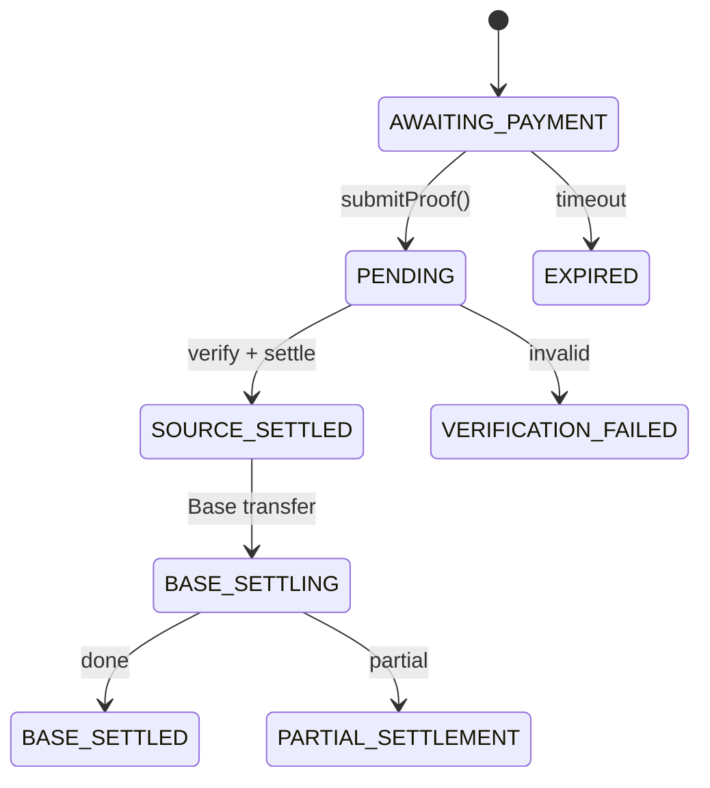

# Agent Public Payment — Local-Signed Payment Workflow

This skill enables AI agents to complete cross-chain USDC payments **end-to-end without a browser or human**: generate wallets locally, create a payment intent via the SDK, sign the X402 authorization with your local key, submit the proof, and poll until settled. Merchants always receive USDC on Base.

**Use Case:** Choose this mode when you need **full control over private keys** and want to sign transactions locally. No API key required - perfect for agents that need direct control over signing and wallet management. Private keys never leave your machine.

**SDK Support:** This skill uses the AgentPay SDK (JavaScript/TypeScript and Go) in **public mode** (`PublicPayClient`). No API key required - you sign X402 proofs locally.

---

## JSON Schema Definition

```json
{
  "name": "agent_public_payment",
  "description": "Complete end-to-end X402 cross-chain payment automation for AI agents using AgentPay SDK in public mode. Generates wallets locally, creates intents, signs X402 proofs locally, submits proofs, and polls for completion. No API key required, full control over private keys.",
  "input_schema": {
    "type": "object",
    "properties": {
      "recipient": {
        "type": "string",
        "description": "Recipient wallet address (Base 0x address) or email address"
      },
      "email": {
        "type": "string",
        "description": "Recipient email address (alternative to recipient)"
      },
      "amount": {
        "type": "string",
        "description": "USDC amount as string (e.g. '10.50'). Minimum: 0.01, Maximum: 1,000,000. Up to 6 decimal places."
      },
      "payer_chain": {
        "type": "string",
        "description": "Source chain identifier. See Supported Chains documentation for the full list of supported chains."
      },
      "wallet_type": {
        "type": "string",
        "enum": ["evm", "solana"],
        "description": "Type of wallet to use for signing (must match payer_chain)"
      }
    },
    "required": ["amount", "payer_chain", "wallet_type"],
    "oneOf": [
      { "required": ["email"] },
      { "required": ["recipient"] }
    ]
  },
  "output_schema": {
    "type": "object",
    "properties": {
      "intent_id": {
        "type": "string",
        "description": "Unique identifier for the created intent"
      },
      "status": {
        "type": "string",
        "enum": ["BASE_SETTLED", "EXPIRED", "VERIFICATION_FAILED"],
        "description": "Final status of the payment"
      },
      "transaction_hash": {
        "type": "string",
        "description": "Transaction hash on Base chain (available when status is BASE_SETTLED)"
      },
      "payer_wallet": {
        "type": "object",
        "description": "Generated wallet information"
      }
    },
    "required": ["intent_id", "status"]
  }
}
```

---

## Quick Start (4 Steps)

1. **Generate and save wallets** (EVM for Base, Solana) — see [Step 1: Generate Wallets](#step-1-generate-wallets).
2. **Create payment intent** — Use SDK `createIntent()` with `email` or `recipient`, `amount`, `payer_chain` → get `intent_id` and `payment_requirements`.
3. **Sign X402 locally** using `payment_requirements` and your wallet private key → produce `settle_proof` (base64 string). See [Step 2: Sign and Produce settle_proof](#step-2-sign-and-produce-settle_proof).
4. **Submit proof** — Use SDK `submitProof(intentId, settleProof)`, then **poll** `getIntent(intentId)` until `status` is `BASE_SETTLED` or `EXPIRED`.

### Complete Example (TypeScript)

```typescript
import { PublicPayClient } from '@agenttech/pay';
import { Wallet } from 'ethers';
import { buildEVMsettleProof } from './x402-signing';

async function completeX402Payment(recipient: string, amount: string) {
  // Step 1: Generate or load wallet
  const wallet = Wallet.createRandom();
  const payerAddress = wallet.address;
  const privateKey = wallet.privateKey;

  // Step 2: Initialize SDK client
  const client = new PublicPayClient({
    baseUrl: 'https://api-pay.agent.tech',
  });

  // Step 3: Create intent
  const intent = await client.createIntent({
    recipient,
    amount,
    payerChain: 'base',
  });

  console.log(`Intent created: ${intent.intentId}`);
  console.log(`Payment requirements:`, intent.paymentRequirements);

  // Step 4: Sign X402 proof locally
  const settleProof = buildEVMsettleProof(
    intent.paymentRequirements,
    payerAddress,
    privateKey
  );

  // Step 5: Submit proof
  const result = await client.submitProof(intent.intentId, settleProof);
  console.log(`Proof submitted. Status: ${result.status}`);

  // Step 6: Poll until completion
  let finalIntent = result;
  while (
    finalIntent.status !== 'BASE_SETTLED' &&
    finalIntent.status !== 'PARTIAL_SETTLEMENT' &&
    finalIntent.status !== 'EXPIRED' &&
    finalIntent.status !== 'VERIFICATION_FAILED'
  ) {
    await new Promise(resolve => setTimeout(resolve, 3000));
    finalIntent = await client.getIntent(intent.intentId);
    console.log(`Status: ${finalIntent.status}`);
  }

  if (finalIntent.status === 'BASE_SETTLED') {
    console.log(`Payment complete! Transaction: ${finalIntent.basePayment.txHash}`);
    return {
      success: true,
      intentId: finalIntent.intentId,
      txHash: finalIntent.basePayment.txHash,
    };
  } else {
    throw new Error(`Payment failed: ${finalIntent.status}`);
  }
}
```

---

## Step 1: Generate Wallets

Generate payer wallets **locally**. Private keys never leave your machine; the SDK only ever receives a signed `settle_proof`.

### EVM (Base)

**TypeScript/JavaScript (ethers):**

```bash
npm install ethers
```

```typescript
import { Wallet } from 'ethers';

const wallet = Wallet.createRandom();
const evmWallet = {
  type: 'evm',
  symbol: 'ETH',
  address: wallet.address,
  private_key: wallet.privateKey,
  mnemonic: wallet.mnemonic?.phrase,
};

console.log(`EVM Address: ${wallet.address}`);
console.log(`Private Key: ${wallet.privateKey}`);
```

**Go:**

```go
package main

import (
    "crypto/ecdsa"
    "fmt"
    "github.com/ethereum/go-ethereum/accounts"
    "github.com/ethereum/go-ethereum/crypto"
)

func generateEVMWallet() (string, string, error) {
    privateKey, err := crypto.GenerateKey()
    if err != nil {
        return "", "", err
    }
    
    publicKey := privateKey.Public()
    publicKeyECDSA, ok := publicKey.(*ecdsa.PublicKey)
    if !ok {
        return "", "", fmt.Errorf("error casting public key")
    }
    
    address := crypto.PubkeyToAddress(*publicKeyECDSA).Hex()
    privateKeyHex := fmt.Sprintf("%x", crypto.FromECDSA(privateKey))
    
    return address, privateKeyHex, nil
}
```

### Solana

**TypeScript/JavaScript (@solana/web3.js):**

```bash
npm install @solana/web3.js
```

```typescript
import { Keypair } from '@solana/web3.js';
import * as bs58 from 'bs58';

const keypair = Keypair.generate();
const solWallet = {
  type: 'solana',
  symbol: 'SOL',
  address: keypair.publicKey.toBase58(),
  private_key: bs58.encode(keypair.secretKey),
};

console.log(`Solana Address: ${keypair.publicKey.toBase58()}`);
```

**Go:**

```go
package main

import (
    "encoding/base64"
    "fmt"
    "github.com/gagliardetto/solana-go"
)

func generateSolanaWallet() (string, string, error) {
    keypair := solana.NewWallet()
    address := keypair.PublicKey().String()
    privateKey := base64.StdEncoding.EncodeToString(keypair.PrivateKey)
    
    return address, privateKey, nil
}
```

### Save Wallets Locally

Store credentials at `~/.config/x402pay/wallets.json` (or equivalent).

**TypeScript:**

```typescript
import * as fs from 'fs';
import * as path from 'path';
import * as os from 'os';

function saveWallets(evmWallet: any, solWallet: any) {
  const walletsData = {
    created_at: new Date().toISOString(),
    wallets: [evmWallet, solWallet],
  };
  
  const configDir = path.join(os.homedir(), '.config', 'x402pay');
  fs.mkdirSync(configDir, { recursive: true });
  
  const filePath = path.join(configDir, 'wallets.json');
  fs.writeFileSync(filePath, JSON.stringify(walletsData, null, 2));
  
  console.log(`Wallets saved to ${filePath}`);
}
```

**Go:**

```go
package main

import (
    "encoding/json"
    "os"
    "path/filepath"
    "time"
)

type WalletData struct {
    CreatedAt string   `json:"created_at"`
    Wallets   []Wallet `json:"wallets"`
}

func saveWallets(evmWallet, solWallet Wallet) error {
    walletsData := WalletData{
        CreatedAt: time.Now().UTC().Format(time.RFC3339),
        Wallets:   []Wallet{evmWallet, solWallet},
    }
    
    configDir := filepath.Join(os.Getenv("HOME"), ".config", "x402pay")
    os.MkdirAll(configDir, 0755)
    
    filePath := filepath.Join(configDir, "wallets.json")
    data, err := json.MarshalIndent(walletsData, "", "  ")
    if err != nil {
        return err
    }
    
    return os.WriteFile(filePath, data, 0600)
}
```

**Security:** Private keys are generated and stored only on your machine. The SDK never receives your private key; it only receives the base64-encoded signed payload (`settle_proof`).

---

## Step 2: Sign and Produce settle_proof

The SDK expects `settle_proof` to be **exactly**: **Base64(JSON.stringify(x402_v2_payload))**. The backend decodes base64, parses JSON, verifies the payload (including `accepted.amount` vs intent), and forwards it to the X402 facilitator for settlement. If the format is wrong, verification fails (400).

**Always use the `payment_requirements` returned by `createIntent()`** when building the payload — do not hardcode chain IDs or contract addresses.

### 2a. EVM (Base) — EIP-712 TransferWithAuthorization

**TypeScript Example (ethers):**

```typescript
import { Wallet } from 'ethers';
import * as crypto from 'crypto';

interface PaymentRequirements {
  scheme: string;
  network: string;
  amount: string;
  asset: string;
  payTo: string;
  maxTimeoutSeconds: number;
  extra?: {
    name?: string;
    version?: string;
  };
}

function buildEVMsettleProof(
  paymentRequirements: PaymentRequirements,
  payerAddress: string,
  privateKey: string
): string {
  // Parse chainId from CAIP-2 (eip155:8453 -> 8453)
  const network = paymentRequirements.network;
  const chainIdMatch = network.match(/eip155:(\d+)/);
  if (!chainIdMatch) {
    throw new Error(`Invalid network format: ${network}`);
  }
  const chainId = parseInt(chainIdMatch[1], 10);

  const amount = paymentRequirements.amount;
  const payTo = paymentRequirements.payTo;
  const asset = paymentRequirements.asset;
  const extra = paymentRequirements.extra || {};
  const name = extra.name || 'USD Coin';
  const version = extra.version || '2';
  const maxTimeout = paymentRequirements.maxTimeoutSeconds || 600;

  // Generate nonce
  const nonce = '0x' + crypto.randomBytes(32).toString('hex');
  
  // Set validity window
  const now = Math.floor(Date.now() / 1000);
  const validAfter = (now - 600).toString();
  const validBefore = (now + maxTimeout).toString();

  // Build EIP-712 domain
  const domain = {
    name,
    version,
    chainId,
    verifyingContract: asset,
  };

  // Build EIP-712 types
  const types = {
    TransferWithAuthorization: [
      { name: 'from', type: 'address' },
      { name: 'to', type: 'address' },
      { name: 'value', type: 'uint256' },
      { name: 'validAfter', type: 'uint256' },
      { name: 'validBefore', type: 'uint256' },
      { name: 'nonce', type: 'bytes32' },
    ],
  };

  // Build message
  const message = {
    from: payerAddress,
    to: payTo,
    value: amount,
    validAfter,
    validBefore,
    nonce,
  };

  // Sign with ethers
  const wallet = new Wallet(privateKey);
  const signature = wallet.signTypedData(domain, types, message);

  // Build X402 v2 payload
  const payload = {
    x402Version: 2,
    resource: {
      url: paymentRequirements.resource || '/api/intents',
      description: paymentRequirements.description || 'X402 payment',
      mimeType: 'application/json',
    },
    accepted: {
      scheme: paymentRequirements.scheme || 'exact',
      network,
      amount,
      asset,
      payTo,
      maxTimeoutSeconds: maxTimeout,
      extra: paymentRequirements.extra || {},
    },
    payload: {
      signature: signature,
      authorization: {
        from: payerAddress,
        to: payTo,
        value: amount,
        validAfter,
        validBefore,
        nonce,
      },
    },
  };

  // Encode as base64
  return Buffer.from(JSON.stringify(payload)).toString('base64');
}
```

### 2b. Solana — Three Instructions + VersionedTransaction v0

**TypeScript Example (@solana/web3.js):**

```typescript
import {
  Keypair,
  PublicKey,
  TransactionMessage,
  VersionedTransaction,
  SystemProgram,
} from '@solana/web3.js';
import {
  createSetComputeUnitLimitInstruction,
  createSetComputeUnitPriceInstruction,
  createTransferCheckedInstruction,
  getAssociatedTokenAddress,
} from '@solana/spl-token';

interface SolanaPaymentRequirements {
  scheme: string;
  network: string;
  amount: string;
  asset: string;
  payTo: string;
  maxTimeoutSeconds: number;
  extra?: {
    feePayer?: string;
    decimals?: number;
  };
}

async function buildSolanasettleProof(
  paymentRequirements: SolanaPaymentRequirements,
  payerKeypair: Keypair
): Promise<string> {
  const payTo = new PublicKey(paymentRequirements.payTo);
  const asset = new PublicKey(paymentRequirements.asset);
  const amount = BigInt(paymentRequirements.amount);
  const extra = paymentRequirements.extra || {};
  const feePayer = extra.feePayer ? new PublicKey(extra.feePayer) : payTo;
  const decimals = extra.decimals || 6;

  // Get associated token address
  const sourceATA = await getAssociatedTokenAddress(asset, payerKeypair.publicKey);
  const destATA = await getAssociatedTokenAddress(asset, payTo);

  // Build instructions
  const instructions = [
    // 1. SetComputeUnitLimit
    createSetComputeUnitLimitInstruction({ units: 200000 }),
    // 2. SetComputeUnitPrice
    createSetComputeUnitPriceInstruction({ microLamports: 1 }),
    // 3. TransferChecked
    createTransferCheckedInstruction(
      sourceATA,
      asset,
      destATA,
      payerKeypair.publicKey,
      amount,
      decimals
    ),
  ];

  // Build transaction message
  const messageV0 = new TransactionMessage({
    payerKey: feePayer,
    recentBlockhash: '11111111111111111111111111111111', // Will be replaced by backend
    instructions,
  }).compileToV0Message();

  // Create versioned transaction
  const transaction = new VersionedTransaction(messageV0);
  transaction.sign([payerKeypair]);

  // Serialize and encode
  const transactionBytes = transaction.serialize();
  const transactionBase64 = Buffer.from(transactionBytes).toString('base64');

  // Build X402 v2 payload
  const payload = {
    x402Version: 2,
    resource: {
      url: paymentRequirements.resource || '/api/intents',
      description: paymentRequirements.description || 'X402 payment',
      mimeType: 'application/json',
    },
    accepted: {
      scheme: paymentRequirements.scheme || 'exact',
      network: paymentRequirements.network,
      amount: paymentRequirements.amount,
      asset: paymentRequirements.asset,
      payTo: paymentRequirements.payTo,
      maxTimeoutSeconds: paymentRequirements.maxTimeoutSeconds,
      extra: paymentRequirements.extra || {},
    },
    payload: {
      transaction: transactionBase64,
    },
  };

  // Encode as base64
  return Buffer.from(JSON.stringify(payload)).toString('base64');
}
```

---

## Step 3: Complete Payment Flow with SDK

### TypeScript/JavaScript Complete Example

```typescript
import { PublicPayClient } from '@agenttech/pay';
import { Wallet } from 'ethers';
import { buildEVMsettleProof } from './x402-signing';

async function completeX402PaymentFlow(
  recipient: string,
  amount: string,
  payerChain: 'base' | 'solana'
) {
  // Initialize SDK client (public mode, no auth required)
  const client = new PublicPayClient({
    baseUrl: 'https://api-pay.agent.tech',
  });

  // Step 1: Generate or load wallet
  const wallet = Wallet.createRandom();
  const payerAddress = wallet.address;
  const privateKey = wallet.privateKey;

  console.log(`Using payer wallet: ${payerAddress}`);

  // Step 2: Create intent
  const intent = await client.createIntent({
    recipient,
    amount,
    payerChain,
  });

  console.log(`Intent created: ${intent.intentId}`);
  console.log(`Status: ${intent.status}`);
  console.log(`Expires at: ${intent.expiresAt}`);

  // Step 3: Sign X402 proof locally
  const settleProof = buildEVMsettleProof(
    intent.paymentRequirements,
    payerAddress,
    privateKey
  );

  console.log('X402 proof signed locally');

  // Step 4: Submit proof
  const submitResult = await client.submitProof(intent.intentId, settleProof);
  console.log(`Proof submitted. Status: ${submitResult.status}`);

  // Step 5: Poll until completion
  let currentIntent = submitResult;
  const maxAttempts = 60; // 10 minutes max (60 * 10 seconds)
  let attempts = 0;

  while (
    currentIntent.status !== 'BASE_SETTLED' &&
    currentIntent.status !== 'PARTIAL_SETTLEMENT' &&
    currentIntent.status !== 'EXPIRED' &&
    currentIntent.status !== 'VERIFICATION_FAILED' &&
    attempts < maxAttempts
  ) {
    await new Promise(resolve => setTimeout(resolve, 10000)); // Poll every 10 seconds
    attempts++;

    try {
      currentIntent = await client.getIntent(intent.intentId);
      console.log(`[${attempts}] Status: ${currentIntent.status}`);
    } catch (error) {
      console.error(`Error polling status: ${error}`);
      // Continue polling on transient errors
    }
  }

  // Final status check
  if (currentIntent.status === 'BASE_SETTLED') {
    console.log('✅ Payment complete!');
    console.log(`Transaction hash: ${currentIntent.basePayment?.txHash}`);
    return {
      success: true,
      intentId: currentIntent.intentId,
      status: currentIntent.status,
      txHash: currentIntent.basePayment?.txHash,
    };
  } else {
    console.error(`❌ Payment failed: ${currentIntent.status}`);
    return {
      success: false,
      intentId: currentIntent.intentId,
      status: currentIntent.status,
    };
  }
}

// Usage
completeX402PaymentFlow(
  '0x742d35Cc6634C0532925a3b844Bc9e7595f0bEb',
  '10.50',
  'base'
).then(result => {
  console.log('Final result:', result);
});
```

### Go Complete Example

```go
package main

import (
    "context"
    "fmt"
    "log"
    "time"
    "github.com/agent-tech/agent-sdk-go"
    "github.com/ethereum/go-ethereum/crypto"
)

func completeX402PaymentFlow(
    ctx context.Context,
    recipient string,
    amount string,
    payerChain string,
) error {
    // Initialize SDK client (public mode, no auth required)
    client, err := pay.NewClient("https://api-pay.agent.tech")
    if err != nil {
        return err
    }

    // Step 1: Generate wallet
    privateKey, err := crypto.GenerateKey()
    if err != nil {
        return err
    }
    payerAddress := crypto.PubkeyToAddress(privateKey.PublicKey).Hex()
    privateKeyHex := fmt.Sprintf("%x", crypto.FromECDSA(privateKey))

    log.Printf("Using payer wallet: %s", payerAddress)

    // Step 2: Create intent
    resp, err := client.CreateIntent(ctx, &pay.CreateIntentRequest{
        Recipient:  recipient,
        Amount:     amount,
        PayerChain: payerChain,
    })
    if err != nil {
        return err
    }

    log.Printf("Intent created: %s", resp.IntentID)
    log.Printf("Status: %s", resp.Status)

    // Step 3: Sign X402 proof locally
    settleProof, err := buildEVMsettleProof(
        resp.PaymentRequirements,
        payerAddress,
        privateKeyHex,
    )
    if err != nil {
        return err
    }

    log.Println("X402 proof signed locally")

    // Step 4: Submit proof
    proofResult, err := client.SubmitProof(ctx, resp.IntentID, settleProof)
    if err != nil {
        return err
    }

    log.Printf("Proof submitted. Status: %s", proofResult.Status)

    // Step 5: Poll until completion
    maxAttempts := 60
    attempts := 0
    currentIntent := proofResult

    for attempts < maxAttempts {
        if currentIntent.Status == pay.StatusBaseSettled ||
           currentIntent.Status == pay.StatusPartialSettlement ||
           currentIntent.Status == pay.StatusExpired ||
           currentIntent.Status == pay.StatusVerificationFailed {
            break
        }

        time.Sleep(10 * time.Second)
        attempts++

        intent, err := client.GetIntent(ctx, resp.IntentID)
        if err != nil {
            log.Printf("Error polling status: %v", err)
            continue
        }

        currentIntent = intent
        log.Printf("[%d] Status: %s", attempts, currentIntent.Status)
    }

    // Final status check
    if currentIntent.Status == pay.StatusBaseSettled {
        log.Println("✅ Payment complete!")
        log.Printf("Transaction hash: %s", currentIntent.BasePayment.TxHash)
        return nil
    } else {
        return fmt.Errorf("payment failed: %s", currentIntent.Status)
    }
}
```

---

## Payment Flow and Status

After you submit `settle_proof`, the backend verifies it and settles on the source chain via the X402 facilitator, then executes the Base payment. Poll `getIntent(intentId)` until a terminal status.

**Status values:**

| Status | Description |
|--------|-------------|
| `AWAITING_PAYMENT` | Intent created; no proof yet |
| `PENDING` | Proof submitted; verification/settlement in progress |
| `SOURCE_SETTLED` | Source chain settled |
| `BASE_SETTLING` | Base payment in progress |
| `BASE_SETTLED` | Done; merchant received USDC on Base |
| `PARTIAL_SETTLEMENT` | Partial amount settled; remainder not fulfilled |
| `VERIFICATION_FAILED` | Proof invalid or settlement failed |
| `EXPIRED` | Intent timed out (e.g. 10 min) |

**Valid payer_chain:** See [Supported Chains](../api/chains.md) for the full list.



---

## Error Handling

### Common Errors

| HTTP Status | Error Type | Description | Solution |
|-------------|------------|-------------|----------|
| 400 | ValidationError | Invalid input, invalid payer_chain, invalid email/recipient/amount, proof validation failed | Fix request parameters or proof format |
| 404 | RequestError | Payment intent not found | Verify intent ID exists |
| 503 | RequestError | Insufficient proxy balance (submit proof) | Retry after delay |
| 500 | RequestError | Internal error | Retry after delay |

### Error Handling Example

```typescript
import { PublicPayClient, PayApiError } from '@agenttech/pay';

async function handlePaymentWithRetry(
  client: PublicPayClient,
  intentId: string,
  settleProof: string
) {
  let retries = 0;
  const maxRetries = 3;

  while (retries < maxRetries) {
    try {
      return await client.submitProof(intentId, settleProof);
    } catch (error) {
      if (error instanceof PayApiError) {
        // Don't retry on client errors
        if (error.statusCode === 400 || error.statusCode === 404) {
          throw error;
        }
        // Retry on server errors
        if (error.statusCode === 503 || error.statusCode === 500) {
          retries++;
          if (retries >= maxRetries) {
            throw error;
          }
          await new Promise(resolve => setTimeout(resolve, 1000 * retries));
          continue;
        }
      }
      throw error;
    }
  }
}
```

---

## Security and Notes

- **Private keys** are generated and used only locally; never send them to the API or SDK.
- **Merchants** always receive **USDC on Base**. Payers can pay from Solana or Base.
- **Email** is resolved to a Base wallet via Privy at intent creation only.
- **SDK Benefits**: The SDK handles HTTP requests, error handling, and response parsing automatically.
- If your AI is the **receiver**, you can present your receiving addresses (or QR codes) to your human owner so they can pay you via this SDK.

---

## Summary Checklist

- [ ] Generate EVM and/or Solana wallets locally; save to `~/.config/x402pay/wallets.json`
- [ ] Initialize SDK client: `new PublicPayClient()` (TypeScript) or `pay.NewClient()` (Go)
- [ ] Create intent: `client.createIntent()` (email or recipient, amount, payer_chain)
- [ ] Sign X402 using **API-returned payment_requirements** (EVM: EIP-712; Solana: 3-instruction VersionedTransaction)
- [ ] Build X402 v2 payload and set **settle_proof** = Base64(JSON.stringify(payload))
- [ ] Submit: `client.submitProof(intentId, settleProof)`
- [ ] Poll `client.getIntent(intentId)` until `BASE_SETTLED` or `EXPIRED`
- [ ] Handle errors with retry logic for transient failures

---

## Related Links

- [Create Intent](create-intent.md)
- [Submit Proof](submit-proof.md)
- [Query Intent Status](query-intent-status.md)
- [Payment Polling](payment-polling.md)
- [Error Handling](error-handling.md)
- [API Documentation: Intents](../api/intents.md)
